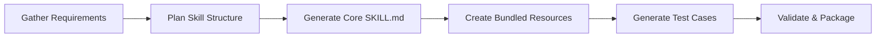
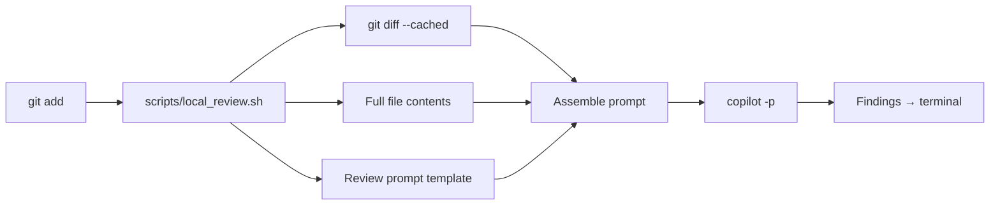
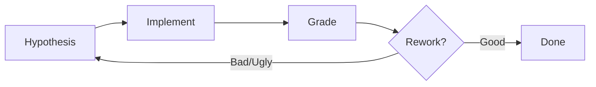
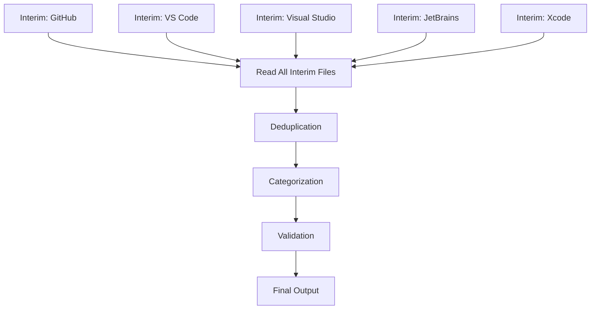

# AI Surfaces — Full Contents

> Complete text of all 31 AI surface files.
> This guarantees 100% AI surface coverage regardless of scan budget.

## AGENTS.md (85L)

```markdown
# AGENTS.md

> Primary AI instruction surface for briancl2-customer-newsletter (platform-agnostic).
> Monthly GitHub customer newsletter pipeline: 6-phase LLM-driven system with skills, scoring, and intelligence mining.

## Operating Protocol

Every change follows this numbered workflow. No exceptions.

1. **Hypothesize** — State a testable prediction with explicit PASS criteria (HIGR)
2. **Score** — Define a scoring rubric with acceptance threshold
3. **Plan** — Design the approach before building
4. **Build** — Implement the change
5. **Test** — Validate against PASS criteria using layered scoring (cheapest first)
6. **Fix** — Iterate until all criteria pass
7. **Review** — Run `make review` on ALL changes before committing. `--no-verify` is NEVER permitted.
8. **Validate** — Run quality checks (scoring battery)
9. **Document** — Update HYPOTHESES.md, LEARNINGS.md, HANDOFF.md
10. **Clean up** — Delete old implementations (Deletion Discipline), archive stale artifacts
11. **Report + Handoff** — Write HANDOFF.md for session continuity

## Core Principles

- **Deletion Discipline**: Replace directly. No `_v2` suffixes, no parallel code paths.
- **LLM-First**: Agent-orchestrated workflows over deterministic scripts.
- **Skills-First**: Check `.github/skills/` before implementing ad-hoc procedures.
- **HIGR**: Every change is a testable hypothesis with PASS criteria.
- **Trust Disk, Not Self-Reports**: Verify by reading files, not trusting agent claims.
- **Layered Scoring (Cheapest First)**: Structural → Heuristic → Selection → Editorial.
- **Feed-Forward Learnings**: Every finding becomes an L-number in LEARNINGS.md.
- **Benchmark-Grounded**: Score against benchmark data, not intuition.

## Agents (4)

| # | Agent | Purpose |
|---|---|---|
| 1 | customer_newsletter | 6-phase pipeline orchestrator |
| 2 | editorial-analyst | Editorial intelligence mining + corrections |
| 3 | skill-builder | Create and validate new skills |
| 4 | upgrade-advisor | Produce recommendation bundles from repo findings |

## Skills (18)

| # | Skill | Purpose |
|---|---|---|
| 1 | url-manifest | Phase 1a: Discover announcement URLs |
| 2 | content-retrieval | Phase 1b: Fetch and extract content |
| 3 | content-consolidation | Phase 1c: Merge discoveries |
| 4 | events-extraction | Phase 2: Extract events and dates |
| 5 | content-curation | Phase 3: Select and organize content |
| 6 | newsletter-assembly | Phase 4: Assemble final newsletter |
| 7 | newsletter-validation | Validate assembled newsletter |
| 8 | newsletter-polishing | Phase 4.5: Apply editorial polish |
| 9 | video-matching | Phase 4.6: Match YouTube videos to entries |
| 10 | editorial-review | Post-assembly editorial corrections |
| 11 | kb-maintenance | Knowledge base upkeep |
| 12 | testing-prompt-changes | A/B test prompt modifications |
| 13 | building-skill | Create new skills (meta-skill) |
| 14 | scope-contract | Manage scope boundaries |
| 15 | curator-notes | Phase 1.5: Process curator brain dump |
| 16 | reviewing-code-locally | Fast local code review |
| 17 | deprecation-consolidation | Phase 4.5: Consolidate deprecation notices |
| 18 | session-log-manager | Archive and inspect Copilot/IDE session logs |

Skills are at `.github/skills/<name>/SKILL.md`.

## Scoring Tools (Layered, Cheapest First)

| Layer | Tool | Max | Use |
|---|---|---|---|
| 1 | `tools/score-structural.sh` | 30 | Gate: must pass before Layer 2 |
| 2 | `tools/score-heuristic.sh` | 41 | Quality dimensions check |
| 3 | `tools/score-selection.sh` | 25 | Content selection quality |
| 4 | `tools/score-v2-rubric.sh` | 50 | Full editorial rubric |

## Key Files

| File | Purpose |
|---|---|
| HYPOTHESES.md | Hypothesis ledger — testable predictions |
| LEARNINGS.md | Append-only operational lessons |
| .github/skills/ | 18 skills |
| tools/ | Scoring + build automation |
| reference/ | Editorial intelligence + source intelligence |
| kb/ | Knowledge base (sources, taxonomy, maintenance) |
```

## .github/agents/customer_newsletter.agent.md (152L)

```markdown
---
name: "customer_newsletter"
description: "Generates monthly customer newsletters via a skills-based pipeline. Orchestrates 6 phases from URL discovery through final assembly and validation."
model: "gpt-5.4"
tools: ['execute/getTerminalOutput', 'execute/runTask', 'execute/getTaskOutput', 'execute/createAndRunTask', 'execute/runInTerminal', 'read/terminalSelection', 'read/terminalLastCommand', 'read/readFile', 'edit/createDirectory', 'edit/createFile', 'edit/editFiles', 'search/changes', 'search/codebase', 'search/fileSearch', 'search/listDirectory', 'search/searchResults', 'search/textSearch', 'web/fetch', 'agent', 'todo']
infer: true
---

<mission>
Generate monthly customer newsletters by orchestrating a skills-based pipeline. Each phase delegates to a dedicated skill. Domain logic lives in skills, not here.
</mission>

## Non-Negotiable Execution Rules

1. Do not compress phases. Phase 1A -> 1B -> 1C -> 2 -> 3 -> 4 -> 4.5 -> 4.6 must be materially executed.
2. Phase 1.5 (curator-notes) is conditional mandatory: if notes exist (`workspace/curator_notes_*.md` or `workspace/<Month>.md`), execute it before Phase 3.
3. Canonical artifact paths are mandatory. Do not create or rely on `fresh_phase*` shortcuts.
4. Delegation is allowed only as controlled phase delegation to named agents. Never delegate to generic or "general-purpose" subagents.
5. Use one delegation unit per phase. Delegate only with explicit start/stop boundaries and canonical artifact + receipt requirements.
6. Preferred delegation map:
   - `customer_newsletter`: Phase 0, 1A, 1B, 2, 3, 4, 4.5, 4.6
   - `editorial-analyst`: Phase 1C, 1.5
   - `skill-builder`: skill-authoring tasks only (not newsletter generation phases)
7. Do not delete `workspace/newsletter_phase_receipts_<END>.json` during an active run.
8. If the user asks for from-scratch generation, run:
   - `bash tools/prepare_newsletter_cycle.sh <START> <END> --no-reuse`
9. Before reporting completion, run strict validation:
   - `bash tools/validate_pipeline_strict.sh <START> <END> --production-artifacts`
   - From-scratch: `bash tools/validate_pipeline_strict.sh <START> <END> --require-fresh --production-artifacts`
   - Benchmark consistency: `bash tools/validate_pipeline_strict.sh <START> <END> --require-fresh --production-artifacts --benchmark-mode feb2026_consistency`
10. If strict validation fails, continue fixing until it passes or explicitly report the blocker.
11. Record phase receipts immediately after each artifact write:
   - `bash tools/record_phase_receipt.sh <START> <END> <phase_id> <artifact_path>`
12. Do not defer receipts until the end of the run.
13. Use canonical `phase_id` values only:
   - `phase0_scope_contract`
   - `phase1a_manifest`
   - `phase1b_github`
   - `phase1b_vscode`
   - `phase1b_visualstudio`
   - `phase1b_jetbrains`
   - `phase1b_xcode`
   - `phase1c_discoveries`
   - `phase1_5_curator_processed`
   - `phase1_5_curator_signals`
   - `phase2_event_sources`
   - `phase2_events`
   - `phase3_working_set`
   - `phase3_curated`
   - `phase4_output`
   - `phase4_5_polishing`
   - `phase4_6_video`
   - `phase4_scope_results`
   - `phase4_editorial_review`
14. Curator-note discovery must include both:
   - `workspace/curator_notes_*.md`
   - `workspace/[A-Za-z]*.md` (for example `workspace/Jan.md`)
   Exclude generated files: `curator_notes_processed_*`, `curator_notes_editorial_signals_*`, and `newsletter_*`.
15. For the February 2026 benchmark window (`2025-12-05` to `2026-02-13`), benchmark mode is mandatory before completion:
    - `bash tools/validate_pipeline_strict.sh <START> <END> --require-fresh --production-artifacts --benchmark-mode feb2026_consistency`
16. If benchmark mode fails, keep iterating until it passes.
17. In Phase 2, generate `workspace/newsletter_phase2_event_sources_<END>.json` before `workspace/newsletter_phase2_events_<END>.md`, and record both receipts (`phase2_event_sources`, `phase2_events`).
18. For Phase 0, run `python3 tools/generate_scope_contract.py <START> <END>` before any broad manual scope discovery. If the helper succeeds, treat its output as the Phase 0 artifact.
19. For orchestrated Phase 3 runs, generate `workspace/newsletter_phase3_working_set_<END>.md` before any broad rereads of discoveries or reference docs, then record `phase3_working_set` before any Phase 3 curation edits.
20. If `workspace/newsletter_phase3_curated_sections_<END>.md` is absent during Phase 3, initialize it with `python3 tools/init_phase3_curated_sections.py <START> <END>` and edit that scaffold in place.
21. When the Phase 3 working set exists and its Missing Data Gate does not flag missing inputs, use it as the primary Phase 3 source. Do not reread raw discoveries, curator notes, `LEARNINGS.md`, or long reference docs unless the working set explicitly says data is missing.
22. During Phase 3, replace all TODO markers and HTML comment placeholders in the curated scaffold before recording `phase3_curated`.

## Audience

**Primary**: Engineering Managers, DevOps Leads, IT Leadership in large regulated enterprises (Healthcare, Manufacturing, Financial Services).
**Secondary**: Developers. Content appeals to both, but distribution is primarily leadership and platform engineering roles.

## Pipeline

| Phase | Skill | Input | Output |
|-------|-------|-------|--------|
| 1A | [url-manifest](.github/skills/url-manifest/SKILL.md) | DATE_RANGE, kb/SOURCES.yaml | `workspace/newsletter_phase1a_url_manifest_*.md` |
| 1B | [content-retrieval](.github/skills/content-retrieval/SKILL.md) | URL manifest | 5 interim files in `workspace/` |
| 1C | [content-consolidation](.github/skills/content-consolidation/SKILL.md) | 5 interim files | `workspace/newsletter_phase1a_discoveries_*.md` |
| 1.5 | [curator-notes](.github/skills/curator-notes/SKILL.md) | Curator notes file + discoveries | `workspace/curator_notes_processed_YYYY-MM.md`, `workspace/curator_notes_editorial_signals_YYYY-MM.md` |
| 2 | [events-extraction](.github/skills/events-extraction/SKILL.md) | `kb/EVENT_SOURCES.yaml` + optional curator notes | `workspace/newsletter_phase2_event_sources_*.json`, `workspace/newsletter_phase2_events_*.md` |
| 3 | [content-curation](.github/skills/content-curation/SKILL.md) | Discoveries | `workspace/newsletter_phase3_curated_sections_*.md` |
| 4 | [newsletter-assembly](.github/skills/newsletter-assembly/SKILL.md) | Curated + Events | `output/YYYY-MM_month_newsletter.md` |
| Post | [newsletter-validation](.github/skills/newsletter-validation/SKILL.md) | Newsletter file | Pass/fail report |
| 4.5 | [newsletter-polishing](.github/skills/newsletter-polishing/SKILL.md) | Newsletter file | Polished newsletter |
| 5 | [editorial-review](.github/skills/editorial-review/SKILL.md) | Corrections + Newsletter | Updated newsletter |
| Utility | [kb-maintenance](.github/skills/kb-maintenance/SKILL.md) | kb/SOURCES.yaml | Delta + health reports |

**Execution order**: 1A, 1B, 1C run sequentially. Phase 2 can run in parallel. If notes file exists, run 1.5 before Phase 3. Phase 4 depends on 3 and 2.

## Category Taxonomy

All items are classified into exactly one category:

- **Security & Compliance**: Secret protection, code scanning, Dependabot, supply chain, audit logs
- **AI & Automation**: Copilot (all IDEs), Extensions, AI-powered features, Actions AI
- **Platform & DevEx**: Repos, PRs, Issues, Projects, Actions, Packages, Codespaces
- **Enterprise Administration**: EMU, SCIM, policies, billing, license management, GHEC/GHES

## Key Formatting Rules

- Bold product names, feature names, dates
- All links as `[Descriptive Text](URL)`, never raw URLs, never `[[Text]](URL)`
- No em dashes; use commas, parentheses, or rephrase
- GA/PREVIEW labels in uppercase; omit when ambiguous
- Never mention Copilot Free/Individual/Pro/Pro+ plans
- Use `reference/github_common_jargon.md` for standard terminology

## Standard Templates

**Introduction**:
"This is a personally curated newsletter for my customers, focused on the most relevant updates and resources from GitHub this month. Highlights for this month include [2-3 highlights]. If you have any feedback or want to dive deeper into any topic, please let me know. Feel free to share this newsletter with others on your team as well. You can find an archive of past newsletters [here](https://github.com/briancl2/CustomerNewsletter)."

**Closing**:
"If you have any questions or want to discuss these updates in detail, feel free to reach out. As always, I'm here to help you and your team stay informed and get the most value from GitHub."

## Prompt Files

| Phase | Prompt |
|-------|--------|
| 1A | `.github/prompts/phase_1a_url_manifest.prompt.md` |
| 1B | `.github/prompts/phase_1b_content_retrieval.prompt.md` |
| 1C | `.github/prompts/phase_1c_consolidation.prompt.md` |
| 2 | `.github/prompts/phase_2_events_extraction.prompt.md` |
| 3 | `.github/prompts/phase_3_content_curation.prompt.md` |
| 4 | `.github/prompts/phase_4_final_assembly.prompt.md` |

## Workflow

0. Read `LEARNINGS.md`. Note lessons relevant to the current cycle.
1. Read the skill for the current phase
2. Read the relevant source intelligence files in `reference/source-intelligence/` for per-source extraction guidance
3. Read `reference/editorial-intelligence.md` for theme detection, selection weights, and treatment patterns
4. Follow the skill's workflow
5. Verify output exists on disk before proceeding to next phase
6. In Phase 2, generate deterministic event candidates first: `python3 tools/extract_event_sources.py <START> <END>`, then record `phase2_event_sources`.
7. Record a phase receipt for each canonical phase artifact using `tools/record_phase_receipt.sh`
8. After Phase 4, run newsletter-validation to confirm quality
9. Produce a Phase 4.5 polishing report at `workspace/newsletter_phase4_5_polishing_<END>.md` and record `phase4_5_polishing`
10. Produce a Phase 4.6 video matching report at `workspace/newsletter_phase4_6_video_matches_<END>.md` and record `phase4_6_video`
11. Produce an editorial review artifact at `workspace/YYYY-MM_editorial_review.md` with per-item ratings (Include/Borderline/Exclude, Expand/Standard/Compress, Lead/Body/Back) for human calibration
12. Run `tools/validate_pipeline_strict.sh` before completion
13. Run `tools/score-v2-rubric.sh --mode auto output/YYYY-MM_month_newsletter.md` before completion
14. In Phase 3 benchmark runs, prefer the compact path: build the working set, record `phase3_working_set`, initialize the scaffold if needed, read the working set, write the curated artifact, validate it, then record `phase3_curated`

## Done When

- Newsletter written to `output/YYYY-MM_month_newsletter.md`
- All mandatory sections present (Introduction, Copilot, Events, Closing)
- `validate_newsletter.sh` passes
- Enterprise focus maintained throughout
```

## .github/agents/editorial-analyst.agent.md (59L)

```markdown
---
name: "editorial-analyst"
description: "Analyzes published newsletters and benchmark intermediates to extract editorial patterns, selection decisions, and thematic intelligence. Use for editorial intelligence mining."
model: gpt-5.4
tools: ['read/readFile', 'edit/createFile', 'edit/editFiles', 'search/fileSearch', 'search/textSearch', 'search/listDirectory', 'search/codebase']
infer: true
---

<mission>
Analyze newsletter data to extract editorial intelligence: what gets included, excluded, expanded, compressed, grouped, or promoted, and why. Produce structured findings that feed into the content-curation skill.
</mission>

## How You Work

You receive a specific analysis task targeting a newsletter cycle, set of newsletters, or benchmark intermediates. You:

1. Read the specified files closely
2. Apply the requested analytical framework
3. Produce structured findings in the specified output format
4. Write findings to the specified output path
5. Do NOT modify any source files

## Analysis Frameworks

### Theme Detection
Identify the dominant theme of a newsletter and what triggered it:
- Count related items that cluster around a topic
- A "lead section" is justified when >=3 items form a coherent narrative
- Record: theme name, triggering items, why this theme outweighs alternatives

### Selection Analysis
Compare raw inputs against curated output to identify selection decisions:
- Items INCLUDED: what enterprise signal made them survive?
- Items EXCLUDED: what made them fall below the bar?
- Items EXPANDED: which got sub-bullets/extra detail and why?
- Items COMPRESSED: which got consolidated into single bullets and why?
- Items GROUPED: which got merged under shared headers and why?

### Audience Signal Detection
Identify language patterns that signal enterprise audience focus:
- Governance, compliance, administration language (+weight)
- Security, risk management, audit language (+weight)
- Individual developer, productivity tricks language (-weight)
- Consumer plan, free tier language (hard exclude)

## Output Format

Always produce structured markdown with:
- Numbered findings (F1, F2, F3...)
- Evidence citations (file, line, specific text)
- Confidence level (High/Medium/Low) with reasoning
- Actionable recommendation for skill improvement

## Key Context

- **Audience**: Engineering Managers, DevOps Leads, IT Leadership at large regulated enterprises (Healthcare, Manufacturing, Financial Services)
- **Newsletter purpose**: Personally curated monthly touchpoint, not an automated digest
- **Tone**: Professional but conversational, personal curator voice
- **Categories**: Security & Compliance, AI & Automation, Platform & DevEx, Enterprise Administration
```

## .github/agents/skill-builder.agent.md (40L)

```markdown
---
name: "skill-builder"
description: "Builds individual newsletter pipeline skills from agent logic, prompt files, and benchmark examples. Use with /fleet for parallel skill construction."
model: gpt-5.4
tools: ['read/readFile', 'edit/createFile', 'edit/editFiles', 'edit/createDirectory', 'search/fileSearch', 'search/textSearch', 'search/listDirectory', 'search/codebase']
infer: true
---

<mission>
Build a single newsletter pipeline skill by extracting domain logic from the agent and prompt files into a well-structured SKILL.md with supporting references.
</mission>

## How You Work

You receive a task specifying which skill to build. For that skill you:

1. **Read the building-skill spec** at `.github/skills/building-skill/SKILL.md`
2. **Read the agent file** at `.github/agents/customer_newsletter.agent.md` — extract the section relevant to your assigned phase
3. **Read the prompt file** for your phase in `.github/prompts/`
4. **Read the benchmark example(s)** in your skill's `examples/` directory
5. **Write SKILL.md** following the building-skill spec — workflow, references, done-when criteria
6. **Write reference files** in `references/` — domain rules extracted from agent and prompt
7. **DO NOT modify** files outside your assigned skill directory

## Quality Standards

- SKILL.md frontmatter must have: name, description (with keywords), metadata.category
- SKILL.md body: Quick Start, Core Workflow, Reference links, Done When
- References: extract domain rules, formatting specs, taxonomy tables from agent/prompt
- Keep SKILL.md under 300 lines; put detail in references/
- Include input/output specification matching the pipeline table
- Match tone and structure of the building-skill spec

## Key Context

- **Audience:** Enterprise engineering leaders (Healthcare, Manufacturing, Financial Services)
- **Category taxonomy:** Security & Compliance, AI & Automation, Platform & DevEx, Enterprise Administration
- **Event categories:** Copilot, GitHub Platform, Developer Experience, Enterprise
- **Plans to exclude:** Copilot Free/Individual/Pro/Pro+
- **Formatting:** No em dashes, no raw URLs, bold product names, `[Text](URL)` links only
```

## .github/agents/upgrade-advisor.agent.md (25L)

```markdown
---
name: "upgrade-advisor"
description: "Repo-star advisor for the newsletter generation repo. Analyze workflow, harness, validation, and execution surfaces and produce bounded improvement recommendations."
model: "gpt-5.4"
tools: ['execute/getTerminalOutput', 'execute/runTask', 'execute/getTaskOutput', 'execute/createAndRunTask', 'execute/runInTerminal', 'read/readFile', 'search/codebase', 'search/fileSearch', 'search/listDirectory', 'search/textSearch', 'edit/createFile', 'edit/editFiles', 'web/fetch']
infer: true
---

<mission>
Analyze this repo as a real newsletter-production workflow, not a generic maturity exercise. Prioritize findings that improve freshness, validator truth, harness reliability, artifact receipts, and operator usability.
</mission>

## Non-Negotiable Rules

1. Treat these surfaces as the primary authority for recommendations:
   - `Makefile`
   - `tools/prepare_newsletter_cycle.sh`
   - `tools/run_newsletter*.sh`
   - `tools/validate_pipeline_strict.sh`
   - `.github/agents/*.agent.md`
   - `.github/skills/*/SKILL.md`
2. Rank workflow-critical issues ahead of generic architecture or style advice.
3. When the prompt asks for `OPPORTUNITIES.md` and `OPPORTUNITIES.json`, write those first and keep the JSON schema-valid.
4. Keep recommendations concrete, patchable, and tied to the repo's actual newsletter flow.
5. Treat `gpt-5.4` as the default model for any touched execution path unless the prompt explicitly says otherwise.
```

## .github/skills/building-skill/SKILL.md (494L)

```markdown
---
name: building-skill
description: "Creates complete Agent Skills from user requirements. Use when the user wants to create, build, design, or generate a new skill, or when they describe automation, workflows, or specialized AI capabilities they want to package as reusable skills. Produces SKILL.md files, scripts, references, assets, and examples following the Agent Skills specification (agentskills.io). Keywords: create skill, build skill, new skill, design skill, generate skill."
license: MIT
metadata:
  author: briancl2
  version: "1.0"
  category: system
---

# Skill Builder

Create complete, production-ready Agent Skills from natural language descriptions. This skill guides you through understanding requirements, planning structure, and generating all necessary files.

## What This Skill Produces

A complete skill package ready for distribution:
```
skill-name/
├── SKILL.md              # Core instructions + metadata
├── scripts/              # Executable automation (Python, Bash)
├── references/           # Documentation loaded into context as needed
├── assets/              # Templates, icons, boilerplate (used in output)
└── examples/            # Input/output examples for testing
```

## Workflow Overview



---

## Step 1: Gather Requirements

Ask targeted questions to understand the skill's purpose. Avoid overwhelming—start with essentials:

### Required Information

1. **Primary Purpose**: "What should this skill help accomplish?"
2. **Trigger Scenarios**: "What would a user say or do that should activate this skill?"
3. **Concrete Examples**: "Give me 2-3 specific examples of how you'd use this skill."

### Contextual Questions (as needed)

- **Input/Output Format**: "What input does the skill receive? What should it produce?"
- **Degree of Freedom**: "Should the output be strictly formatted or flexible?"
- **External Dependencies**: "Does this require specific tools, APIs, or file types?"
- **Domain Knowledge**: "Is there specialized knowledge the skill needs?"

### Conclude Step 1 When

You can describe:
- 3+ concrete usage examples
- Clear trigger conditions
- Expected input/output patterns
- Any special requirements or constraints

---

## Step 2: Plan Skill Structure

Analyze each concrete example to determine what reusable resources to include.

### Decision Framework

For each example, ask:

| Question | If YES → Include |
|----------|-----------------|
| Does it require repetitive code? | `scripts/` - executable utilities |
| Does it need domain knowledge? | `references/` - documentation |
| Does it use templates/boilerplate? | `assets/` - files used in output |
| Does it benefit from examples? | `examples/` - input/output pairs |

### Resource Planning Template

```markdown
## Planned Resources for [skill-name]

### scripts/
- [ ] script_name.py - Purpose: [what it does]

### references/
- [ ] topic.md - Purpose: [what knowledge it provides]

### assets/
- [ ] template.ext - Purpose: [how it's used in output]

### examples/
- [ ] example_input.txt → example_output.txt
```

### Structure Patterns

**1. Workflow-Based** (sequential processes)
- Structure: Overview → Decision Tree → Step 1 → Step 2...
- Best for: Multi-step procedures with clear phases
- Example: Document processing, deployment pipelines

**2. Task-Based** (tool collections)
- Structure: Overview → Quick Start → Task Category 1 → Task Category 2...
- Best for: Skills with multiple independent operations
- Example: PDF tools, image editor, file utilities

**3. Reference/Guidelines** (standards or specs)
- Structure: Overview → Guidelines → Specifications → Usage...
- Best for: Brand guidelines, coding standards, documentation
- Example: Style guide, API documentation generator

**4. Capabilities-Based** (integrated systems)
- Structure: Overview → Core Capabilities → Feature 1 → Feature 2...
- Best for: Skills with interrelated features
- Example: Project management, CRM integration

---

## Step 3: Generate SKILL.md

### Frontmatter Requirements

```yaml
---
name: skill-name           # Required: lowercase, hyphens only, ≤64 chars
description: [detailed]    # Required: what + when to use, ≤1024 chars
license: MIT               # Optional: license identifier
metadata:                  # Optional: custom key-value pairs
  author: name
  version: "1.0"
  category: system         # Required: system or domain
---
```

### Description Best Practices

The description is the PRIMARY trigger mechanism. Include:

1. **What the skill does** - Clear capability statement
2. **When to use it** - Specific triggers, scenarios, file types
3. **Keywords** - Terms that might appear in user requests

**Good Example:**
```yaml
description: Creates data visualizations from CSV, JSON, or SQL query results. Use when the user asks for charts, graphs, dashboards, or wants to visualize data. Supports bar, line, pie, scatter, and heatmap chart types with customizable styling.
```

**Bad Example:**
```yaml
description: Helps with data visualization.
```

### Body Guidelines

Write instructions as if onboarding another AI agent:

- **Use imperative form**: "Generate the report" not "You should generate"
- **Be specific, not verbose**: Prefer examples over explanations
- **Reference resources with paths**: `See [schema](references/schema.md)`
- **Keep under 500 lines**: Split longer content into references

### Body Structure Template

```markdown
# [Skill Title]

[1-2 sentence overview]

## Quick Start

[Minimal steps to use the skill for the most common case]

## Core Workflow

[Main procedures with decision points]

## Reference

- [Topic 1](references/topic1.md) - When to consult
- [Topic 2](references/topic2.md) - When to consult

## Resources

List of bundled scripts/assets with brief descriptions.
```

---

## Step 4: Create Bundled Resources

### scripts/ Directory

Executable code that performs specific operations.

**Guidelines:**

... [TRUNCATED at 200 lines]
```

## .github/skills/content-consolidation/SKILL.md (122L)

```markdown
---
name: content-consolidation
description: "Merges, deduplicates, and filters 5 interim files for enterprise relevance. Use when running Phase 1C of the newsletter pipeline. Takes 5 source-specific interim files from Phase 1B, consolidates into 30-50 enterprise-relevant discoveries. Keywords: consolidation, phase 1c, deduplication, enterprise filter, discoveries."
metadata:
  category: domain
  phase: "1C"
---

# Content Consolidation

Merge, deduplicate, and filter 5 Phase 1B interim files into a single discoveries document.

## Quick Start

1. Read all 5 interim files from Phase 1B
2. Aggregate items into a working list with source tracking
3. Deduplicate: same feature from multiple sources becomes one item
4. Categorize into 5 taxonomy categories
5. Filter for enterprise relevance (score 5+)
6. Write output to `workspace/newsletter_phase1a_discoveries_YYYY-MM-DD_to_YYYY-MM-DD.md`

## Inputs

All 5 Phase 1B interim files (required):
- `workspace/newsletter_phase1b_interim_github_*.md`
- `workspace/newsletter_phase1b_interim_vscode_*.md`
- `workspace/newsletter_phase1b_interim_visualstudio_*.md`
- `workspace/newsletter_phase1b_interim_jetbrains_*.md`
- `workspace/newsletter_phase1b_interim_xcode_*.md`

## Output

- **File**: `workspace/newsletter_phase1a_discoveries_YYYY-MM-DD_to_YYYY-MM-DD.md`
- **Target**: 20-40 items with balanced category distribution

> **Legacy naming note**: The output filename uses `phase1a_discoveries` despite being produced by Phase 1C. This is a historical convention preserved for compatibility with benchmark data, archived intermediates, and downstream prompt references. All downstream consumers (content-curation, prompts, agent) reference this exact name pattern.

## Core Workflow

> **Key finding** (see `reference/source-intelligence/meta-analysis.md`): Cross-cycle analysis shows the pipeline does NOT cut items. 100% discovery survival in Aug+Jun+May 2025. The real editorial value is in ADDITIONS (Azure, devblogs, resources), BUNDLING (models, parity, governance), and EXPANSION (flagships). This phase should ENRICH and CONSOLIDATE, not just filter.

### Step 1: Aggregate

Read all 5 interim files. For each item, record: source file, date, title, URLs, status (GA/PREVIEW), relevance score, IDE support.

### Step 1.5: Enrich (Gap-Filling)

Check for known under-discovery gaps (L29, L30, L31). These sources are consistently missing from Phase 1B output but always appear in published newsletters:

- **Visual Studio devblogs**: Search GitHub Changelog for entries containing "Visual Studio". Check devblogs.microsoft.com/visualstudio/ for monthly Copilot updates.
- **Azure ecosystem**: Check devblogs.microsoft.com/devops/ for Azure DevOps migration content, Azure MCP Server, Copilot for Azure updates.
- **GitHub news-insights**: Check github.blog/news-insights/company-news/ for strategic CPO/CEO announcements not in the changelog feed.
- **Enablement resources**: Check resources.github.com for new rollout playbooks, training content, Copilot Fridays additions.

### Step 2: Deduplicate

See [consolidation-rules.md](references/consolidation-rules.md) for full dedup logic.

**Key rules**:
- Same feature from multiple sources: merge into single item, keep earliest date, combine all URLs, note IDE support breadth
- Same feature with different dates: single item with rollout timeline
- Similar but distinct features (e.g., "Auto model for VS Code" vs "Auto model for JetBrains"): keep separate but note relationship

### Step 3: Categorize

Apply the 5-category taxonomy with target counts:

| Category | Target Count | Scope |
|----------|-------------|-------|
| Monthly Announcement Candidates | 3-5 | Platform-wide, major launches, enterprise-impacting |
| Copilot Latest Releases | 8-12 | Models, IDE features, chat/agent enhancements |
| Copilot at Scale | 4-6 | Admin, policy, metrics, adoption, customization |
| GitHub Platform Updates | 5-10 | GHAS, Actions, Code Search, PRs, general platform |
| Deprecations and Migrations | 0-3 | End-of-life, migration requirements |

### Step 4: Enterprise Relevance Filter

Apply relevance scoring (1-10 scale):
- **9-10**: Must include (GA enterprise features, major security)
- **7-8**: Strong candidate (significant updates)
- **5-6**: Include if space permits
- **1-4**: Exclude

**Always exclude**: Copilot Free/Individual/Pro/Pro+ features, consumer-only features, minor bug fixes.

### Step 5: Label and Validate

- Apply consistent status labels: (GA), (PREVIEW), (EXPERIMENTAL), (DEPRECATED), (RETIRING)
- Add IDE support matrix using checkmarks
- Cross-reference: model releases should appear in Changelog + IDE notes; feature GA should appear in Blog + Changelog
- Verify all items are within DATE_RANGE and Reference Year

### Step 5.5: Coverage Audit

Check that ALL standard newsletter categories have been assessed. If a category that appeared in recent newsletters has ZERO items, explicitly note: `[Category]: No updates found in DATE_RANGE (verified: checked [sources])`. This prevents silent omission of recurring sections.

Standard categories to audit: Security Updates, Code Quality, Platform Updates, Enterprise Admin, IDE Updates, Copilot Features, Deprecations.

### Step 6: Write Output

Write the discoveries file with:
- Coverage summary table (source, item count, date range)
- Items organized by category
- Each item with full metadata
- Validation results checklist

## Reference

- [Consolidation Rules](references/consolidation-rules.md) - Dedup logic, scoring, taxonomy
- [Editorial Intelligence](../../../reference/editorial-intelligence.md) - Theme detection, selection weights, expansion/compression rules
- [Benchmark Example](examples/) - Known-good Dec 2025 discoveries

## Done When

- [ ] Discoveries file exists at `workspace/newsletter_phase1a_discoveries_*.md`
- [ ] Total items: 20-40
- [ ] Category distribution within target ranges
- [ ] Zero duplicate items across sources
- [ ] No consumer-plan items included
- [ ] All items have source URLs (markdown links)
- [ ] All items within DATE_RANGE
- [ ] IDE coverage from all 5 sources represented
```

## .github/skills/content-curation/SKILL.md (191L)

```markdown
---
name: content-curation
description: "Transforms the compiled Phase 3 working set into polished, newsletter-ready content sections, with Phase 1C discoveries used only as a missing-data fallback. Use when running Phase 3 of the newsletter pipeline. Selects and structures high-value items, applies GA/PREVIEW labels, and prepares complete section material for assembly. Keywords: content curation, phase 3, selection, formatting, enterprise relevance."
metadata:
  category: domain
  phase: "3"
---

# Content Curation

Transform the Phase 3 working set into polished, newsletter-ready content sections, using Phase 1C discoveries only when the working set flags missing data.

## Quick Start

1. In orchestrated runs, first generate `workspace/newsletter_phase3_working_set_YYYY-MM-DD.md` with `python3 tools/build_phase3_working_set.py START END`
2. If `workspace/newsletter_phase3_curated_sections_YYYY-MM-DD.md` does not exist yet, create the canonical scaffold with `python3 tools/init_phase3_curated_sections.py START END`
3. Always edit the canonical scaffold in place. Do not create the curated sections artifact ad hoc through a generic create-file flow
4. If the working set exists, use it as the primary Phase 3 input and do not reread raw discoveries, interim IDE files, or long reference docs unless it explicitly flags missing data
5. Read Phase 1C discoveries from `workspace/newsletter_phase1a_discoveries_*.md` when no working set exists or the working set flags missing data
6. Select items using selection criteria with range-aware depth targets
7. Organize into full newsletter sections: Lead (optional), Copilot (Latest + IDE Parity), Enterprise and Security, Platform, Resources and Best Practices
8. Apply formatting: bold terms, GA/PREVIEW labels, embedded links, strip metadata
9. Validate the edited artifact with `python3 tools/validate_phase3_curated.py START END workspace/newsletter_phase3_curated_sections_YYYY-MM-DD.md`

## Inputs

- **Phase 3 Working Set**: `workspace/newsletter_phase3_working_set_*.md` (primary input in orchestrated mode)
- **Phase 1C Discoveries**: `workspace/newsletter_phase1a_discoveries_*.md` (fallback only when the working set is absent or flags missing data)

## Output

- **File**: `workspace/newsletter_phase3_curated_sections_YYYY-MM-DD.md`
- **Target**: range-aware depth
  - >=60-day range: 24+ curated bullets
  - >=30-day range: 18+ curated bullets
  - <30-day range: 12+ curated bullets
- **Content**: Full section-ready material (no final intro/closing text)

## Core Workflow

### Step 0: Initialize the Canonical Artifact

If `workspace/newsletter_phase3_curated_sections_YYYY-MM-DD.md` is absent, run:

```bash
python3 tools/init_phase3_curated_sections.py START END
```

Then edit that scaffold in place for the remainder of Phase 3. Do not switch to a different filename or try to recreate the artifact via a generic create-file action.

### Step 1: Analyze Working Set First

Read the compiled Phase 3 working set first. Only fall back to Phase 1C discoveries if the working set is absent or its Missing Data Gate explicitly says data is missing. Inventory candidates by:
- Enterprise relevance and impact
- Recency within DATE_RANGE
- Thematic clusters that could drive a lead section
- Overlapping/duplicate items needing consolidation

### Step 2: Select and Bundle Items

Apply selection criteria in priority order. See [selection-criteria.md](references/selection-criteria.md).

> **Key finding** (see `reference/source-intelligence/meta-analysis.md`): Cross-cycle analysis shows discoveries have ~100% survival rate. The curation job is NOT selection (nearly everything survives). It is:
> 1. **Bundling**: Models → single bullet. IDE parity → nested bullet. Governance cluster → single enriched bullet.
> 2. **Flagship detection**: 1-2 items per cycle get expanded dedicated sections.
> 3. **Gap-filling**: Add Azure, devblogs, enablement content the pipeline missed.
> 4. **Competitive framing**: Identify competitive positioning signals (CLI vs Claude Code, 3P agents, OpenCode, BYOK = platform openness).

Priority weights:
1. **Competitive positioning** (3.5x) — features that counter rival tools
2. **Governance/Admin** (3.0x) — policies, controls, billing, metrics
3. **Security/Compliance** (2.5x) — scanning, GHAS, supply chain
4. **GA Status** (2.0x) — GA always leads
5. **Novelty** (2.0x) — underappreciated items, new categories, legal changes
6. **Platform openness** (2.0x) — BYOK, 3P integrations, multi-surface
7. **IDE Parity** (1.5x) — cross-IDE rollout
8. **Copilot Features** (1.0x baseline)

### Step 3: Organize Into Sections

**Lead Section** (optional): Only when the working set bundles show a clear theme (major launch, vision update). If you must fall back to discoveries, derive the title from that same dominant cluster rather than a generic label.

**Copilot (H1) + Latest Releases (H2)**: Use `# Copilot` then `## Latest Releases`. New features, model updates, and agent capabilities go here. VS Code features are grouped by feature theme (not by version number). Never reference specific VS Code version numbers in bullet text; version numbers appear only in links.

**Enterprise and Security Updates**: Governance, billing, compliance, security controls, deprecations.

**GitHub Platform Updates**: Actions, Projects, PR workflows, repository/platform improvements.
> **Benchmark override:** When `BENCHMARK_MODE=feb2026_consistency`, fold these into Enterprise and Security instead of a standalone H1.

**Resources and Best Practices**: Enablement assets, implementation guides, adoption assets, operator tips.

**Events handoff stubs**: Curate references that should feed into event framing, including virtual, in-person, and behind-the-scenes cues.

**Copilot CLI placement (mandatory)**:
- Keep the consolidated Copilot CLI bullet in `# Copilot Everywhere: ...`, not under Enterprise/Platform.
- The CLI bullet must include legal links while in preview:
  - `https://docs.github.com/en/site-policy/github-terms/github-dpa-previews`
  - `https://docs.github.com/en/site-policy/github-terms/github-pre-release-license-terms`
- Include `https://github.com/github/copilot-cli/releases` in the same bullet or its immediate "See also" links.

### Step 3.5: Build Cross-IDE Feature Alignment Matrix (L66)

Before writing the IDE parity section, build a feature alignment matrix. This is the single most important step for IDE parity quality.

**Procedure**:
1. List ALL features that appeared in ANY non-VS-Code IDE during the period (Visual Studio, JetBrains, Eclipse, Xcode)
2. For each feature, check its **end-of-period status** in EACH IDE:
   - `GA` = Generally Available
   - `PREVIEW` = Public Preview / Experimental
   - `—` = Not available in this IDE
3. Cross-reference with VS Code status (from Latest Releases) to identify parity vs. unique features
4. Record the matrix in a working table:

```
| Feature | VS Code | Visual Studio | JetBrains | Eclipse | Xcode |
|---------|---------|--------------|-----------|---------|-------|
| Agent Skills | GA | — | PREVIEW | — | — |
| MCP Registry | GA | — | PREVIEW | — | PREVIEW |
```

5. Use this matrix to generate the IDE parity section:
   - **Every IDE that had ANY update MUST appear** (all 4 non-VS-Code IDEs if they had updates)
   - **Every feature MUST have a GA/PREVIEW label** per IDE (never omit labels)
   - **Feature-centric format** (list features per IDE, not versions per IDE)
   - JetBrains: list features with labels, NOT version-by-version changelogs
   - Include the standard rollout note at the bottom

**Gate**: If Eclipse or Xcode had releases in the period but do not appear in the parity section, STOP and add them.

### Step 4: Format

See [content-format-spec.md](references/content-format-spec.md) for complete formatting rules.

Key rules:
- Strip all raw metadata (dates, scores, IDE fields) from output
- Merge duplicates into single consolidated entry
- Bold key terms, no em dashes, no raw URLs
- GA/PREVIEW labels when known, omit when ambiguous
- Link priority: [Announcement] > [Docs] > [Release Notes] > [Changelog]
- Consolidate model rollouts into single "Model availability updates" bullet
- Surface governance/legal under Copilot at Scale

### Step 5: Quality Check

Before writing output:
- [ ] Lead section included only when clear theme exists
- [ ] Copilot section has Latest Releases + IDE Parity grouping
- [ ] Copilot at Scale includes enterprise items + changelog links
- [ ] GA before PREVIEW when both exist for same feature
- [ ] Labels omitted when ambiguous
- [ ] No Copilot Free/Individual/Pro/Pro+ mentions
- [ ] Metadata stripped from final bullets
- [ ] All links use `[Text](URL)` format (never `[[Text]](URL)`)
- [ ] Status labels verified per-IDE (never assume GA because another IDE is GA)
- [ ] PREVIEW features with DPA coverage have a Note with link
- [ ] Quantitative metrics are directly from source (no derived calculations)
- [ ] Sections with 3+ items have a bold framing intro: **Theme** -- Enterprise context
- [ ] Feature descriptions cross-checked against docs, not just changelog titles
- [ ] Range-aware depth floor met (24+/18+/12+ bullets)
- [ ] `Resources and Best Practices` material present when enablement sources exist
- [ ] At least one curator-note signal (if notes exist) is reflected in curated sections

## Reference

- [Selection Criteria](references/selection-criteria.md) - Priority hierarchy, enterprise filter, audience weights
- [IDE Parity Rules](references/ide-parity-rules.md) - Parity bullet format, rollout note
- [Content Format Spec](references/content-format-spec.md) - Bullet format, link priority, governance rules
- [Editorial Intelligence](../../../reference/editorial-intelligence.md) - Theme detection, expansion triggers, competitive positioning
- [Benchmark Example](examples/) - Known-good Dec 2025 curated sections

## Key Signals to Watch For

Before curating, check for these high-weight signals in the working set bundles, then use Phase 1C only if the working set explicitly says data is missing:
1. **Competitive positioning**: CLI features (vs Claude Code), 3P agent support, OpenCode, BYOK (platform openness)
2. **Governance clustering**: >=5 admin/policy/compliance items forming a narrative
3. **Blog posts from news-insights/**: Major strategic announcements (CPO/CEO posts) that may not be in the changelog
4. **VS Code hidden features**: Read the actual release notes page, not just the changelog entry summary

## Done When

- [ ] Curated sections file exists at `workspace/newsletter_phase3_curated_sections_*.md`
- [ ] Canonical scaffold was initialized first when the curated file was absent
- [ ] Range-aware depth floor is met (24+/18+/12+ bullets by window size)
- [ ] Proper section structure is present (Lead if warranted, Copilot, Enterprise and Security, Platform, Resources and Best Practices)
- [ ] GA/PREVIEW labels present where known
- [ ] IDE Parity pattern with rollout note included
- [ ] Standard changelog links in Copilot section footer
- [ ] Copilot CLI consolidated bullet is under Copilot Everywhere and includes DPA + Pre-Release Terms links
- [ ] No raw metadata, no em dashes, no raw URLs
- [ ] Enterprise focus throughout
- [ ] `python3 tools/validate_phase3_curated.py START END <artifact>` passes
```

## .github/skills/content-retrieval/SKILL.md (199L)

```markdown
---
name: content-retrieval
description: "Fetches and extracts content from Phase 1A URL manifest into 5 interim files by source. Use when running Phase 1B of the newsletter pipeline. Processes URLs sequentially by source, extracts relevant items using universal extraction format, outputs one interim file per source. Keywords: content retrieval, phase 1b, web extraction, interim files."
metadata:
  category: domain
  phase: "1B"
---

# Content Retrieval

Fetch content from Phase 1A URLs and extract items into 5 interim files (one per source).

## Quick Start

1. Read the Phase 1A URL manifest from `workspace/newsletter_phase1a_url_manifest_*.md`
2. Process sources sequentially: GitHub, VS Code, Visual Studio, JetBrains, Xcode
3. For each source: fetch URLs, extract features, write interim file, checkpoint
4. Output: 5 files in `workspace/newsletter_phase1b_interim_{source}_*.md`

## Inputs

- **Phase 1A Manifest**: `workspace/newsletter_phase1a_url_manifest_*.md` (required)
- **DATE_RANGE**: Inherited from manifest
- **Reference Year**: Inherited from manifest

## Output

5 interim files in `workspace/`:
- `newsletter_phase1b_interim_github_YYYY-MM-DD_to_YYYY-MM-DD.md`
- `newsletter_phase1b_interim_vscode_YYYY-MM-DD_to_YYYY-MM-DD.md`
- `newsletter_phase1b_interim_visualstudio_YYYY-MM-DD_to_YYYY-MM-DD.md`
- `newsletter_phase1b_interim_jetbrains_YYYY-MM-DD_to_YYYY-MM-DD.md`
- `newsletter_phase1b_interim_xcode_YYYY-MM-DD_to_YYYY-MM-DD.md`

## Core Workflow

### Sequential 5-Chunk Processing

Process sources one at a time to manage context window. After each chunk: write file, confirm, clear working memory.

```
Chunk 1: GitHub Blog + Changelog -> Write interim -> Checkpoint
Chunk 2: VS Code (Copilot only) -> Write interim -> Checkpoint
Chunk 3: Visual Studio (Copilot only) -> Write interim -> Checkpoint
Chunk 4: JetBrains Plugin -> Write interim -> Checkpoint
Chunk 5: Xcode CHANGELOG -> Write interim -> Complete
```

### Runtime Constraint: Controlled Delegation Only

During CLI pipeline runs in this repo, unbounded or generic delegation can deadlock Phase 1B after retrieval and before interim file creation.

Hard rules:
- Do not delegate to generic or "general-purpose" subagents.
- If delegation is used, delegate only to a named agent with a strict Phase 1B boundary and explicit stop condition.
- Always verify that all 5 interim files are written before exiting Phase 1B.

### CRITICAL: Anchor Unit = Feature, NOT Version

The primary organizing unit is a **feature or update**, NOT a plugin/IDE version. Even when source material groups content by version, decompose each version into individual feature entries. This is critical for Phase 1C deduplication.

**Wrong** (version-based): "JetBrains 1.5.60 added X, Y, Z"
**Right** (feature-based): Separate entries for X, Y, and Z with full metadata each

### CRITICAL: IDE Monthly Update Deep-Read (G4)

When an IDE monthly update is detected (VS Code release notes, Visual Studio monthly update, JetBrains plugin version), **deep-read the full release notes page**, not just the changelog summary. IDE release notes pages contain 10-20x more detail than changelog entries. Extract ALL sections; downstream curation will filter. This is the single highest-value extraction action per L20 and L34.

### CRITICAL: VS Code Multi-Release Extraction (L64 + L66)

VS Code now ships weekly releases. A 30-day newsletter period typically includes 4-5 releases; a 60-day period includes 8-10. The extraction MUST be **feature-centric, not version-centric**.

**Diff-Based Strategy (read newest first, diff earlier)**:
1. Get the full list of VS Code versions in scope from the scope contract
2. **Read the NEWEST version page first and fully** -- this represents the most mature state of every feature. Extract all Copilot-relevant features from this page as the primary feature set.
3. **For each EARLIER version page** (working backward chronologically), scan and extract ONLY:
   a. **Features that don't appear in the newer version** (removed, renamed, or one-time announcements)
   b. **Status changes** -- the key signal is a feature moving from EXPERIMENTAL to PREVIEW to GA across versions. Record the version where each transition happened.
   c. **First-appearance dates** -- note which version first introduced each feature
4. **Output a single unified feature list** with evolution metadata per item:
   - Feature name and current (latest) status
   - First-appeared version and date
   - GA version (if the feature went GA during this period)
   - Links to the MOST RELEVANT version page (the one where the feature description is richest)
   - Evolution note only when status changed across versions (e.g., "experimental in v1.108, GA in v1.109")
5. **NEVER output version-summary bullets** ("v1.108 introduced X, Y, Z"). The output is features, not versions.
6. **NEVER reference VS Code version numbers in feature descriptions**. Version numbers appear only in link URLs and evolution metadata. The newsletter period is the unit, not any individual version.

**Why newest-first**: Weekly releases have heavy feature overlap. The newest page has the most mature description of each feature. Earlier pages only need to be scanned for deltas (new features, status transitions).

**Gate**: If scope contract lists N versions and extraction only processed fewer than N, STOP and re-check. Missing a version means missing status transitions.

When JetBrains has multiple plugin releases in the date range, extract EACH version separately with its features. Do not collapse multiple versions into one entry. Downstream curation needs the granularity to decide whether IDE Updates warrants its own section.

### CRITICAL: Surface Attribution

When extracting features, verify which SURFACE the feature actually lives on. A feature announced in the same changelog entry as VS Code features may actually be a github.com feature (e.g., Agents Tab is on github.com, not VS Code). Check the feature's actual URL/documentation to confirm the surface. Common misattributions: Agents Tab = github.com, ACP = CLI, Enterprise Teams API = github.com admin.

### CRITICAL: Status Label Verification

Never infer GA status from feature maturity or adoption. Check the EXACT changelog entry or docs page for the explicit status label. A label is only justified when the source text contains the exact words "generally available", "public preview", "technical preview", "experimental", or "beta". If the source says "now available" or "now supports" without an explicit status qualifier, **omit the label entirely** rather than guessing. Common over-claims to avoid: BYOK (was PREVIEW, pipeline labeled GA), OpenCode support (was unlabeled announcement, pipeline added GA), CLI tools (often PREVIEW long after launch), VS Code features without explicit labels, new IDE integrations, 3P platform features.

### Extraction Format

Every item must follow the universal extraction format. See [extraction-format.md](references/extraction-format.md) for the complete field specification.

### Source-Specific Extraction Strategies

Each source has a fundamentally different data model. Use source-specific approaches:

- **VS Code**: Apply the **Multi-Release Extraction** strategy above (L64 + L66). Read the newest version page fully, then diff earlier versions for status changes and new features. VS Code changelogs hide important features behind terse summaries -- always deep-read the actual release notes pages. Extract ALL sections from the newest page; learn what survives downstream. Copilot Chat UX, Agent, MCP, and Security sections have highest survival rates, but editor/terminal features sometimes contain Copilot-integrated items worth including. With weekly releases, expect 4-10 version pages per newsletter period -- the diff-based strategy prevents redundant extraction.

- **Visual Studio**: The MS Learn release notes page (`learn.microsoft.com/en-us/visualstudio/releases/2022/release-notes`) is a rolling patch page (17.14.1 through 17.14.26+). The Features section at top is undated and covers the entire 17.14 lifecycle. Individual patch versions are mostly bug fixes and CVEs. **PRIMARY source for VS Copilot features is the GitHub Changelog** (entries like "GitHub Copilot in Visual Studio - [Month] update", "Agent mode is now GA in Visual Studio"). Cross-reference the MS Learn page for patch-specific Copilot fixes. For VS 2026 (launched Nov 24, 2025), use the separate release notes page.

- **GitHub Blog/Changelog**: Richest source overall. Monthly archives at `github.blog/changelog/YYYY/MM/`. **ALSO scan `github.blog/news-insights/company-news/`** for major strategic announcements (CPO/CEO blog posts) that do NOT appear in the changelog feed. Missing these is a critical gap (e.g., Agent HQ 3P platform launch was only on news-insights).

- **JetBrains**: Plugin API returns terse "What's New" notes. Cross-reference with GitHub Changelog entries mentioning "JetBrains" within ±3 days of plugin release date for feature detail. The Changelog is where the narratives live.

- **Xcode**: Single CHANGELOG.md on GitHub. "Added" and "Changed" sections are the primary content. Skip "Fixed" unless security-related. Cross-reference with GitHub Changelog for Xcode-specific announcements.

- **Copilot CLI**: The **primary source is `github.com/github/copilot-cli/releases`**, NOT the GitHub blog changelog. The CLI ships daily releases (sometimes multiple per day), so a 30-day newsletter period can include 30+ releases. The blog changelog only publishes occasional summary posts that lag behind and miss most features. **Extraction strategy**: (1) Fetch the releases page and scan all stable releases (skip pre-releases with `-N` build suffixes appended to the version number, e.g., `v0.0.404-0`, `v0.0.404-1`; stable releases have no suffix after the final digit) whose date falls within DATE_RANGE. (2) Aggregate features across all releases into a single feature-centric list — never produce per-version bullets. (3) Categorize features by type: major capabilities (plan mode, background agents, plugins), platform integrations (ACP, MCP, SDK), quality-of-life (slash commands, permissions, themes), and bug fixes (skip unless security-related). (4) Cross-reference with GitHub blog changelog posts for richer narrative descriptions of major features — blog posts are supplementary links, not the discovery source. (5) The CLI is NOT in the Copilot feature matrix; pair CLI features with blog changelog links where available.

### Copilot CLI Command Block (Benchmark Override)

Run these explicit commands during Phase 1B when benchmarking against February 2026 fidelity:

```bash
# 1) Pull releases feed and keep stable tags only (exclude pre-release suffixes like -0 / -1)
curl -sL "https://github.com/github/copilot-cli/releases.atom" \
| rg -o 'v[0-9]+\.[0-9]+\.[0-9]+(-[0-9]+)?' \
| rg -v -- '-[0-9]+$' \
| python3 -c "import re, sys; tags=sorted(set(sys.stdin.read().split()), key=lambda t: tuple(int(x) for x in re.findall(r'\\d+', t)[:3])); print('\\n'.join(tags))" \
> /tmp/copilot_cli_stable_tags.txt

# 2) Fetch recent stable release pages (latest 5 from the feed)
tail -n 5 /tmp/copilot_cli_stable_tags.txt | while read -r tag; do
  curl -sL "https://github.com/github/copilot-cli/releases/tag/${tag}" \
    > "/tmp/copilot_cli_${tag}.html" || true
done

# 3) Feb 2026 anchor tags (fetch only if present in the stable tag list)
for tag in v0.0.400 v0.0.404 v0.0.406; do
  if rg -qx "$tag" /tmp/copilot_cli_stable_tags.txt; then
    curl -sL "https://github.com/github/copilot-cli/releases/tag/${tag}" \
      > "/tmp/copilot_cli_${tag}.html" || true
  fi
done

# 4) Ensure interim output includes:
#    - releases index URL
#    - at least 2 release tag URLs
#    - extracted capability bullets (delegate/background agents/plugins/autopilot)
```

If `rg` is unavailable, use `grep -oE` as a fallback for the tag extraction step.

Minimum output requirement in `workspace/newsletter_phase1b_interim_github_*.md`:
- `https://github.com/github/copilot-cli/releases`
- At least two `https://github.com/github/copilot-cli/releases/tag/<tag>` URLs
- A consolidated CLI capability summary grounded in those tag pages

### Cross-Referencing

- JetBrains plugin versions: cross-reference with GitHub Changelog (plus/minus 3 days)
- VS Code features: cross-reference with GitHub Changelog for matching announcements
- Include all discovered URLs in each item's Links field

### Status Markers

- **(GA)**: Generally available, production-ready
- **(PREVIEW)**: Public preview, experimental, or beta
- **(RETIRED/DEPRECATED)**: Being removed or replaced

### Per-Chunk Validation

Before moving to next chunk, verify:
- [ ] All manifest URLs for this source were processed
- [ ] Output is feature-based, not version-based
- [ ] Each entry has date, description, links, relevance score, IDE tag
- [ ] All dates within DATE_RANGE
- [ ] Interim file written and confirmed on disk

## Reference

- [Extraction Format](references/extraction-format.md) - Universal extraction format specification
- [Benchmark Examples](examples/) - 5 known-good Dec 2025 interim files
- [VS Code Intelligence](../../../reference/source-intelligence/vscode.md) - 50% discovery rate; Agent/MCP/Chat UX survive; experimental and UI polish drop
- [Visual Studio Intelligence](../../../reference/source-intelligence/visualstudio.md) - Dual-source: GH Changelog for features, MS Learn for patches. 42% discovery rate.
- [JetBrains Intelligence](../../../reference/source-intelligence/jetbrains.md) - Highest survival (77%); always bundled into IDE Parity bullets
- [Xcode Intelligence](../../../reference/source-intelligence/xcode.md) - Lowest survival (37%); most items are UI polish; only cross-IDE features survive
- [GitHub Changelog Intelligence](../../../reference/source-intelligence/github-changelog.md) - Richest source; COPILOT-labeled items survive at 80%; scan news-insights/ too

## Done When

- [ ] All 5 interim files exist in `workspace/`
- [ ] All files use feature-based format (not version-based)
- [ ] VS Code and Visual Studio contain ONLY Copilot-related features
- [ ] Total item count is reasonable (expect 40-100 items across all sources)
- [ ] No unresolved fetch failures
```

## .github/skills/curator-notes/SKILL.md (159L)

```markdown
---
name: curator-notes
description: "Processes the human curator's monthly notes file into pipeline-ready content. Reads raw URLs, text hints, and structured sections from the curator's brain dump, classifies each item, filters internal/industry content, visits surviving URLs, and outputs processed items + editorial signals. Use between Phase 1C and Phase 3 when a curator notes file exists. Keywords: curator notes, brain dump, links file, monthly notes, human curation, editorial signals."
metadata:
  category: domain
  phase: "1.5"
---

# Curator Notes Processing

Process the human curator's monthly notes file into pipeline-ready content and editorial signals.

## Quick Start

1. Check for `workspace/curator_notes_YYYY-MM.md` (or known variants)
2. If no file exists, skip this phase entirely -- pipeline continues normally
3. Parse and classify every item using the link type taxonomy
4. Filter: internal links become editorial signals; public links get visited
5. Output processed items + editorial signals
6. Items feed into Phase 3 curation alongside Phase 1C discoveries

## Inputs

- **Curator notes file** (optional): `workspace/curator_notes_YYYY-MM.md`
  - May also appear as: `workspace/<month>.md`, `workspace/<Month>.md`, `workspace/Jan.md`, etc.
  - Check for any `.md` file in `workspace/` that looks like a brain dump of links
- **Phase 1C Discoveries**: For cross-reference (avoid duplicates)

## Output

- `workspace/curator_notes_processed_YYYY-MM.md` -- Items in universal extraction format, ready for Phase 3
- `workspace/curator_notes_editorial_signals_YYYY-MM.md` -- Priority hints, theme suggestions, internal context

## Core Workflow

### Step 0: Locate the Notes File

Check these paths in order:
1. `workspace/curator_notes_YYYY-MM.md` (canonical)
2. `workspace/<Month>.md` (e.g., `workspace/Jan.md`, `workspace/February.md`)
3. Any `.md` file in `workspace/` containing 3+ URLs that isn't a pipeline output

If no file found: **SKIP. Output nothing. Pipeline continues.**

### Step 1: Parse and Classify

For each line/item in the notes file, classify into one of these types:

| Type | Detection Pattern | Action |
|------|-------------------|--------|
| **GitHub Changelog** | `github.blog/changelog/` | PROCESS: visit URL, extract item |
| **GitHub Blog** | `github.blog/news-insights/` or `github.blog/ai-and-ml/` | PROCESS: visit URL, extract item |
| **VS Code Release Notes** | `code.visualstudio.com/updates/` | PROCESS: visit URL, extract features |
| **Microsoft DevBlog** | `devblogs.microsoft.com/` | PROCESS: visit if GitHub-specific |
| **Community resource** | `github.com/<user>/`, personal sites, awesome-lists | PROCESS: visit URL, extract description |
| **VS Code extension** | `marketplace.visualstudio.com/` | PROCESS: visit URL, extract description |
| **YouTube video** | `youtube.com/watch`, `youtu.be/` | PROCESS: visit, extract title and context |
| **Event registration** | `registration.goldcast.io/`, `github.com/resources/events/` | PROCESS: extract event details |
| **Named feature hint** | Text line without URL referencing a product name | SIGNAL: flag as editorial priority |
| **Internal link** | `github.slack.com/`, `docs.google.com/`, `github.com/github/` (private repos), `thehub.github.com/` | SIGNAL: translate topic to public reference |
| **Industry content** | `hbr.org/`, `substack.com/`, `medium.com/`, `martinfowler.com/`, analyst reports | SIGNAL: framing context only |
| **Competitor content** | `blog.cloudflare.com/`, `sonarsource.com/`, etc. | SIGNAL: competitive context only |
| **Text note** (vague) | Bare text, no URL, no product name | SIGNAL: note for context |

### Step 2: Filter and Route

**PROCESS items** (visit, extract, output as discoveries):
- GitHub Changelog, Blog, VS Code, DevBlog, Community, Extensions, Videos, Events
- Visit each URL and extract: title, date, description, enterprise relevance

**SIGNAL items** (output as editorial signals):
- Internal links: identify the topic and note "watch for public announcement about [topic]"
- Industry content: summarize the thesis for framing context
- Named feature hints: flag as lead section candidates
- Competitor content: note competitive positioning opportunity

### Step 3: Cross-Reference with Phase 1C

For each PROCESS item, check if Theme 1C discoveries already cover it:
- **Already covered**: Mark as "REINFORCEMENT" (human agreed this is important -- boost priority in Phase 3)
- **Not covered**: Mark as "ADDITION" (unique content from curator -- must include in Phase 3)

### Step 4: Visit and Extract

For each PROCESS item not already covered by Phase 1C:
1. Fetch the URL
2. Extract: title, date, description (2-3 sentences), enterprise relevance (1-10)
3. Format in universal extraction format
4. Assign category from the newsletter taxonomy

### Step 5: Write Outputs

**Processed items** (`workspace/curator_notes_processed_YYYY-MM.md`):
```markdown
## Curator Notes: Processed Items

### Additions (not in Phase 1C)
- **[Item Title]** -- Description. - [Label](URL)
  - Source: Curator notes
  - Enterprise Relevance: N/10

### Reinforcements (also in Phase 1C -- boost priority)
- **[Item Title]** -- Already in discoveries. Curator explicitly flagged.
```

**Editorial signals** (`workspace/curator_notes_editorial_signals_YYYY-MM.md`):
```markdown
## Editorial Signals from Curator Notes

### Lead Section Candidates
- [Feature hint]: Curator named this explicitly. Consider for lead.

### Priority Boosts
- [Topic]: Curator linked N items about this topic. Strong signal.

### Framing Context
- [Industry article summary]: Useful for newsletter introduction framing.

### Internal Signals (not linkable)
- [Slack thread topic]: Something is happening around [X]. Watch for public announcement.
```

## Integration with Pipeline

- **Phase 1C -> Phase 1.5 (this skill) -> Phase 3**
- Phase 3 (content-curation) reads BOTH Phase 1C discoveries AND curator notes processed items
- Editorial signals inform Phase 3's lead section decision and item prioritization
- If a named feature hint matches a Phase 1C discovery, it gets 2.0x priority boost

## Link Type Survival Intelligence

From analysis of 10 benchmark cycles (see `reference/curator-notes-intelligence.md`):

| Type | Survival Rate | Notes |
|------|:---:|---|
| Named feature hints | 100% | Always become sections/leads |
| Community resources | 100% | Pipeline can't find these |
| Team member content | 100% | Personal curation uniqueness |
| GitHub Changelog | 67% | May be superseded |
| Microsoft DevBlog | 50% | Only if GitHub-specific |
| YouTube videos | 25% | Only major conference sessions |
| Internal links | 0% | Translate to public references |
| Industry blogs | 0% | Framing context only |
| Analyst reports | 0% | Never linked directly |

## Reference

- [Curator Notes Intelligence](../../../reference/curator-notes-intelligence.md) -- Full analysis from 10 benchmark cycles
- [Content Format Spec](../content-curation/references/content-format-spec.md) -- Output formatting rules

## Done When

- [ ] Notes file located (or confirmed absent)
- [ ] All items classified by type
- [ ] Public URLs visited and extracted
- [ ] Cross-referenced with Phase 1C discoveries
- [ ] Processed items file exists (if notes file existed)
- [ ] Editorial signals file exists (if notes file existed)
- [ ] No internal links leaked to processed items output
```

## .github/skills/deprecation-consolidation/SKILL.md (74L)

```markdown
---
name: deprecation-consolidation
description: "Consolidates all deprecation, sunset, revocation, and migration-notice content into a single bundled update under Enterprise and Security Updates, and removes any standalone Migration Notices section. Use when assembling or polishing a newsletter, or when you see duplicated deprecation notes across multiple sections (models, metrics, runner enforcement, token revocations, syntax changes). Keywords: deprecation, deprecated, sunset, migration notice, breaking change, enforcement, revoked, revocation, end-of-life, EOL, retiring."
metadata:
  category: domain
  phase: "4.5"
---

# Deprecation Consolidation

Ensure deprecations and migration notices are **not duplicated** across the newsletter and are **presented once** in the right place.

## Quick Start

1. Read the assembled newsletter file at `output/YYYY-MM_month_newsletter.md`.
2. Find all deprecation/migration/sunset content anywhere in the document.
3. Move it into a **single bundled bullet** under **Enterprise and Security Updates**.
4. Delete any standalone `# Migration Notices` section.
5. Re-run validation: `bash .github/skills/newsletter-validation/scripts/validate_newsletter.sh output/YYYY-MM_month_newsletter.md`.

## Core Rules (Hard Requirements)

### Rule 1: Single bundled update

All of these belong in **one** bullet (one paragraph) under **Enterprise and Security Updates**:

- Deprecations (models/features/SDKs)
- Sunsets / API shutdowns
- Token revocations
- Minimum version enforcement
- Syntax changes that can break workflows (e.g., comment commands)

Use a title like:
- `**Deprecations and Migration Notices** -- ...`

### Rule 2: No bottom-of-newsletter migration section

Do **not** end the newsletter with a standalone section like:
- `# Migration Notices`

If it exists, it must be removed and its content merged into the Enterprise & Security bullet.

### Rule 3: Remove duplicate mentions elsewhere

If deprecation content appears in other bullets (common places: model availability bullets, metrics bullets), do one of:

- Remove the deprecation sentence/link entirely, OR
- Replace it with a short pointer: "See Deprecations and Migration Notices in Enterprise and Security Updates."

Prefer removal over pointers unless the section would otherwise become misleading.

## Editing Workflow

1. **Inventory**: Identify every deprecation/migration statement and every link that implies deprecation (e.g., `upcoming-deprecation`, `closing-down-notice`, `revoked`, `minimum-version-enforcement`).
2. **Choose canonical placement**: Under **Enterprise and Security Updates**, immediately after the most related bullet (often metrics/governance).
3. **Bundle**: Write one bullet that lists the items as **bolded phrases** in a single sentence/paragraph.
4. **Linking**: Include the authoritative links (usually changelog entries) as pipe-separated links at the end.
5. **Delete old section**: Remove `# Migration Notices` heading and its bullet(s).
6. **Re-scan for dupes**: Ensure the same deprecation link doesn’t appear in multiple sections.

## Optional Helper

Run the helper script to surface candidates:

```bash
python3 .github/skills/deprecation-consolidation/scripts/find_deprecations.py output/YYYY-MM_month_newsletter.md
```

## Done When

- [ ] Newsletter contains **no** `# Migration Notices` section
- [ ] Exactly one bundled deprecations/migration bullet exists under Enterprise & Security
- [ ] Deprecation/sunset links are not duplicated in other sections
- [ ] `validate_newsletter.sh` exits 0
```

## .github/skills/editorial-review/SKILL.md (133L)

```markdown
---
name: editorial-review
description: "Applies human editorial corrections to a generated newsletter and produces an updated version. Use as Phase 5 after the human provides corrections. Reads corrections file, applies changes to newsletter, updates intelligence files, captures learnings. Keywords: editorial review, phase 5, corrections, iteration, review loop."
metadata:
  category: domain
  phase: "5"
---

# Editorial Review Loop

Apply human editorial corrections to a Phase 4 newsletter and produce an updated version.

## Quick Start

1. Read the corrections file at `workspace/YYYY-MM_editorial_corrections.md`
2. Read the current newsletter at `output/YYYY-MM_month_newsletter.md`
3. Read `reference/editorial-intelligence.md` for calibrated rules
4. Apply each correction to the newsletter
5. Update intelligence files with new patterns
6. Validate the updated newsletter
7. Capture learnings in LEARNINGS.md

## Inputs

- **Corrections File**: `workspace/YYYY-MM_editorial_corrections.md` (required)
- **Current Newsletter**: `output/YYYY-MM_month_newsletter.md` (required)
- **Editorial Intelligence**: `reference/editorial-intelligence.md` (context)
- **Source Intelligence**: `reference/source-intelligence/meta-analysis.md` (context)

## Output

- **Updated Newsletter**: `output/YYYY-MM_month_newsletter.md` (overwrite in place)
- **Updated Intelligence**: Changes to `reference/editorial-intelligence.md` if corrections reveal new patterns
- **New Learnings**: Appended to `LEARNINGS.md`

## Corrections File Format

The human writes corrections to `workspace/YYYY-MM_editorial_corrections.md`. The required structure, sections, and per-item table format are defined in the single authoritative spec: [correction-format.md](references/correction-format.md). Use that document as the source of truth for how to structure and label all corrections.

When running this skill, assume the corrections file strictly follows `references/correction-format.md` and treat any deviations as format errors to be surfaced back to the human editor.
- Item name, what to do with it (remove / compress / bundle)

## Bundling Corrections
[Items that should be combined or separated]
| Bundle | Items | Treatment |

## Depth Corrections
[Items that need more or less detail]
- Item name: expand / compress, what detail to add/remove

## Tone/Framing Corrections
[Narrative or framing changes needed]
```

## Core Workflow

### Step 1: Parse Corrections

Read the corrections file and categorize each correction:

| Type | Action |
|------|--------|
| **Theme correction** | Rewrite lead section with new theme |
| **Missing item** | Add item with source URL and appropriate detail |
| **Wrong item** | Remove, compress, or bundle as specified |
| **Bundling correction** | Combine items or split them per instructions |
| **Depth correction** | Expand or compress specific items |
| **Tone/framing** | Rewrite affected sections |

### Step 2: Apply Corrections to Newsletter

For each correction, modify the newsletter in place:

1. **Theme changes**: Replace the lead section title, framing paragraph, and reorganize lead items
2. **Additions**: Insert new items in the appropriate section, following the content-format-spec
3. **Removals**: Delete the item entirely or compress into a bundle
4. **Bundling**: Merge items into a single bullet with sub-items, or split a bundle into separate bullets
5. **Depth changes**: Expand with sub-bullets or compress to a single line
6. **Tone changes**: Rewrite the affected paragraph(s)

### Step 3: Validate Updated Newsletter

Run validation:
```bash
bash .github/skills/newsletter-validation/scripts/validate_newsletter.sh output/YYYY-MM_month_newsletter.md
```

Check:
- [ ] All corrections applied (count corrections vs changes made)
- [ ] Validation passes (0 errors)
- [ ] Line count in expected range (100-170 lines)
- [ ] No new forbidden patterns introduced
- [ ] All new items have source URLs

### Step 4: Update Intelligence Files

If corrections reveal new editorial patterns, update:

1. **`reference/editorial-intelligence.md`**: Add new theme triggers, adjust selection weights, add expansion/compression rules
2. **`reference/source-intelligence/meta-analysis.md`**: Note new source gaps or patterns
3. **Selection criteria**: If the correction shows a weight was miscalibrated

Only update when the correction reveals a PATTERN, not a one-off preference.

### Step 5: Capture Learnings

Append to `LEARNINGS.md`:
- One learning per correction type that reveals a generalizable pattern
- Include: ID, Lesson, Evidence (the specific correction), Fix (what to change in the system)

### Step 6: Score V1 vs V2

If a scoring rubric exists for this month (`tools/score-v2-rubric.sh`), run it on the updated newsletter and compare to the pre-correction score.

Report:
- V1 score (pre-correction)
- V2 score (post-correction)
- Dimensions that improved
- Rework cycles used

## Reference

- [Correction Format](references/correction-format.md) - Standard correction file format and examples
- [Editorial Intelligence](../../../reference/editorial-intelligence.md) - Theme detection, selection weights, treatment patterns
- [Source Intelligence](../../../reference/source-intelligence/meta-analysis.md) - Cross-cycle findings

## Done When

- [ ] All corrections from the corrections file have been applied
- [ ] Updated newsletter passes validate_newsletter.sh
- [ ] Intelligence files updated (if patterns detected)
- [ ] Learnings captured in LEARNINGS.md
- [ ] V1 vs V2 comparison reported
```

## .github/skills/events-extraction/SKILL.md (188L)

```markdown
---
name: events-extraction
description: "Extracts and formats upcoming events and webinars from provided URLs. Use when running Phase 2 of the newsletter pipeline. Fetches event pages, classifies into canonical categories, formats virtual and in-person event tables. Can run in parallel with Phases 1A-1C. Keywords: events extraction, phase 2, webinars, conferences, event formatting."
metadata:
  category: domain
  phase: "2"
---

# Events Extraction

Extract, classify, and format upcoming events and webinars for the newsletter.

## Quick Start

1. Receive list of event URLs (5-15 typical)
2. Fetch each URL and extract event details
3. Classify: Virtual, In-person, or Hybrid
4. Assign canonical categories (max 2, prefer 1)
5. Format into tables and bullet lists
6. Write output to `workspace/newsletter_phase2_events_YYYY-MM-DD.md`

**Independence**: This phase runs independently of Phases 1A-1C and can execute in parallel.

## Inputs

- **Deterministic Phase 2 event-source artifact** (mandatory):
  - `workspace/newsletter_phase2_event_sources_YYYY-MM-DD.json`
  - Generated by: `python3 tools/extract_event_sources.py <START_DATE> <END_DATE>`
- **Deterministic source config** (required by extractor):
  - `kb/EVENT_SOURCES.yaml`
- **Optional direct URLs** (fallback only when artifact is missing):
  - `https://github.com/resources/events`
  - `https://developer.microsoft.com/en-us/reactor/series/S-1625/`
  - `https://developer.microsoft.com/en-us/reactor/series/S-1631/`
  - Note: Reactor series IDs are curated seeds and should be refreshed during KB maintenance.
- **Curator notes file** (optional): `workspace/Jan.md` or similar
- **COLLECTION_DATE**: Date for filename (defaults to today)

## Output

- **File**: `workspace/newsletter_phase2_events_YYYY-MM-DD.md`

## Core Workflow

### Step 0: Deterministic Source Extraction

Run deterministic extraction before event curation:

```bash
python3 tools/extract_event_sources.py <START_DATE> <END_DATE>
```

Then verify output exists:

- `workspace/newsletter_phase2_event_sources_<END_DATE>.json`

If this phase is part of a full run, record receipt immediately after writing the JSON:

```bash
bash tools/record_phase_receipt.sh <START_DATE> <END_DATE> phase2_event_sources workspace/newsletter_phase2_event_sources_<END_DATE>.json
```

### Step 1: Discovery

Use the deterministic JSON candidates as primary inputs. Scan all candidate URLs, then enrich with in-range event detail pages.

**GitHub Resources Events** (`github.com/resources/events`):
- Fetch the page and event deep links (`github.com/resources/events/<slug>`), extract all upcoming events
- These are primarily in-person events (AI Tour, GitHub Connect, conferences) and KUWC virtual series

**Microsoft Reactor** (series pages + event deep links):
- Prefer series pages and deep links from the JSON artifact
- Follow series links (for example S-1625 Agentic DevOps Live) to gather session pages
- Avoid Reactor search URLs as row-level event links

**Microsoft AI Tour** (`aitour.microsoft.com`):
- Check for cities where GitHub has a confirmed booth/presence
- Cross-reference with github.com/resources/events (AI Tour events appear on both)

**Curator notes**: Check for manually added event URLs or KUWC series entries

### Step 1.5: Reactor Event Filtering (L69)

The Reactor catalog contains many events. Apply these filters:

**INCLUDE** (all must be true):
- Event is in English
- Event involves GitHub, Copilot, GHAS, VS Code, or Azure DevOps with GitHub integration
- Event is relevant to enterprise engineering leaders (not consumer/hobbyist)
- Event provides actionable training, product updates, or security guidance

**INCLUDE event types**:
- Agentic DevOps Live series (GitHub + Azure integration, modernization, security)
- VS Code Live release events (product updates)
- AI Dev Days with GitHub/Azure tracks (hackathons with enterprise prizes)
- Security sessions using GHAS + Defender for Cloud
- App modernization with Copilot agents (Java, .NET)
- GitHub + Azure DevOps workflow sessions

**EXCLUDE**:
- Non-English language events (Spanish, Portuguese, etc.)
- Competition/gaming formats ("Agents League Battle", esports-inspired)
- Generic AI framework tutorials without GitHub integration (LangChain4j, generic Python AI)
- Beginner-level series on non-GitHub tools
- Events with no GitHub speaker or GitHub product involvement

**Key signal**: Check the event tags. Events tagged with `Github`, `GitHub Copilot`, `Agentic DevOps`, or `VS Code` are strong candidates. Events tagged only with `AI` or generic topics without GitHub involvement should be excluded.

### Step 2: Extraction

Extract required fields per event:
- Event title (exact from source)
- Date (normalize to date only for virtual; include CT times only for conference sessions)
- Format: Virtual, In-person, or Hybrid
- Registration URL (direct sign-up link)

Optional but recommended:
- Location (City, ST, Country for in-person)
- Description (1-2 sentences, enterprise value focused)
- Speakers (if available)
- Series information

### Step 3: Classification

See [events-formatting.md](references/events-formatting.md) for complete formatting rules.

**Canonical categories** (use ONLY these, prefer 1, max 2):
- **Copilot**: All GitHub Copilot related sessions (VS Code AI events implicitly map here)
- **GitHub Platform**: Core platform, Actions, general feature launches
- **Developer Experience**: Workflows, training, productivity enablement
- **Enterprise**: Compliance, governance, administration, security policy

**Skill level**: Include only "Introductory" or "Advanced" when explicitly stated. Omit otherwise.

### Step 4: Formatting

**Virtual events**: `## Virtual Events` heading, table with Date + Event + Categories (NO times)
**In-person events**: `## In-Person Events` heading, table with Date + Location + Event
**Behind the scenes**: `## Behind the scenes` heading, short bullets for operational notes/recordings
**Hybrid events**: List under In-person with "(Hybrid, virtual attendance available)"
**Conference sessions**: Detailed tables with Date + Time (CT) + Session + Description

### Step 5: Standard Content

Always include these blocks in the output:
- Copilot Fridays back catalog link
- Brian's YouTube playlists (3 playlists)

### Step 6: Validation

Before writing output:
- [ ] Title, date, and registration URL present for all events
- [ ] Conference session times converted to CT
- [ ] All links embedded as markdown (no raw URLs)
- [ ] Hybrid listed under In-person with virtual note
- [ ] Categories use canonical taxonomy: `Copilot`, `Copilot, Advanced`, `Copilot, New Features`, `GHAS`, `GHAS, Security`, `Enterprise`, `GitHub Platform`. Never use `Developer Productivity` or `Platform` alone.
- [ ] Enterprise relevance satisfied
- [ ] Source diversity present: include event links from both GitHub Resources and Microsoft Reactor when available in range
- [ ] At least one Reactor-linked event appears in Virtual Events for >=30-day ranges when Reactor has in-range GitHub events
- [ ] Event count floor by range length:
  - >=60-day range: 12+ total events
  - >=30-day range: 8+ total events
  - <30-day range: 4+ total events
- [ ] Event row URLs are deep links, not landing/search placeholders
- [ ] Do not use these as row-level event URLs:
  - `https://resources.github.com/events/`
  - `https://github.com/resources/events`
  - `https://developer.microsoft.com/en-us/reactor/?search=...`
  - `https://resources.github.com/copilot-fridays-english-on-demand/`

## Reference

- [Events Formatting](references/events-formatting.md) - Table specs, category mapping, timezone rules
- [Benchmark Example](examples/) - Known-good Dec 2025 events

## Done When

- [ ] Event-source artifact exists at `workspace/newsletter_phase2_event_sources_*.json`
- [ ] Events file exists at `workspace/newsletter_phase2_events_*.md`
- [ ] All provided URLs processed
- [ ] Virtual events in table format (date only, no times)
- [ ] In-person events in table format (`Date`, `Location`, `Event`)
- [ ] `## Behind the scenes` section present with short notes
- [ ] Canonical categories only (Copilot, GitHub Platform, Developer Experience, Enterprise)
- [ ] Standard content blocks included (Copilot Fridays, YouTube playlists)
- [ ] Event count floor met for date range
- [ ] At least one Reactor-sourced event included when Reactor has in-range enterprise events
- [ ] No raw URLs in output
```

## .github/skills/kb-maintenance/SKILL.md (66L)

```markdown
---
name: kb-maintenance
description: "Maintains kb/ knowledge base through automated polling and health checks. Use for monthly kb/ refresh, link health validation, and SOURCES.yaml updates. Polls RSS/Atom feeds for new content, validates canonical URLs, generates delta reports. Keywords: kb maintenance, knowledge base, link health, sources refresh, monthly maintenance."
metadata:
  category: domain
  phase: utility
---

# KB Maintenance

Keep the knowledge base current through automated polling and health checks.

## Quick Start

1. Poll feeds: `python3 .github/skills/kb-maintenance/scripts/poll_sources.py [--dry-run]`
2. Check links: `python3 .github/skills/kb-maintenance/scripts/check_link_health.py [--dry-run] [--sample N]`
3. Review delta report and fix broken links
4. Update `kb/SOURCES.yaml` and `kb/CURRENT_STATE_SNAPSHOT.md`

## Inputs

- **kb/SOURCES.yaml**: Primary data source (47 entries with canonical URLs and feeds)
- **kb/CURRENT_STATE_SNAPSHOT.md**: Current state documentation

## Output

- Delta report: what's new since last poll
- Health report: broken links, redirects, status changes
- Updated SOURCES.yaml (if fixes needed)

## Core Workflow

### Monthly Maintenance Cycle

1. **Poll feeds** - Read SOURCES.yaml `update_feeds`, fetch RSS/Atom/API endpoints, identify new entries since `last_checked` date
2. **Check link health** - Validate `canonical_urls` and `latest_known.reference_url`, report dead links and redirects
3. **Generate delta report** - What's new, what's broken, what needs manual review
4. **Update sources** - Fix broken URLs, update `last_checked`, add new sources if discovered
5. **Update snapshot** - Refresh `CURRENT_STATE_SNAPSHOT.md` with current state

### Feed Types

| Type | How to Poll | Example |
|------|------------|---------|
| RSS/Atom | Fetch XML, parse entries after `last_checked` | GitHub Blog RSS |
| API | Fetch JSON, filter by date | JetBrains plugin API |
| none | Manual check required | Docs pages (no feed) |

See [maintenance-procedure.md](references/maintenance-procedure.md) for full workflow details.

## Scripts

- [poll_sources.py](scripts/poll_sources.py) - Poll RSS/Atom feeds, emit delta report
- [check_link_health.py](scripts/check_link_health.py) - Validate URLs, emit health report

## Reference

- [Maintenance Procedure](references/maintenance-procedure.md) - Monthly workflow, feed types, cadence

## Done When

- [ ] Feed polling completed (or --dry-run passed)
- [ ] Link health check completed (or --dry-run passed)
- [ ] Delta report generated
- [ ] Broken links documented
- [ ] SOURCES.yaml updated with `last_checked` dates
```

## .github/skills/newsletter-assembly/SKILL.md (135L)

```markdown
---
name: newsletter-assembly
description: "Assembles all pipeline components into the complete, polished newsletter. Use when running Phase 4 of the newsletter pipeline. Combines Phase 3 curated sections with Phase 2 events, adds introduction and closing, enforces section ordering and quality checks. Keywords: newsletter assembly, phase 4, final assembly, newsletter generation."
metadata:
  category: domain
  phase: "4"
---

# Newsletter Assembly

Assemble Phase 3 curated sections and Phase 2 events into a complete newsletter.

## Quick Start

1. Read Phase 3 curated sections from `workspace/newsletter_phase3_curated_sections_*.md`
2. Read Phase 2 events from `workspace/newsletter_phase2_events_*.md`
3. Create introduction with 2-3 key highlights
4. Assemble sections in mandatory order
5. Add standard closing, changelog links, YouTube playlists
6. Enforce heading structure and density targets for long windows
7. Write output to `output/YYYY-MM_month_newsletter.md`

## Inputs

- **Phase 3 Curated Sections**: `workspace/newsletter_phase3_curated_sections_*.md` (required)
- **Phase 2 Events**: `workspace/newsletter_phase2_events_*.md` (required)

## Output

- **File**: `output/YYYY-MM_month_newsletter.md`
- Complete newsletter ready for distribution

## Core Workflow

### Step 1: Create Introduction

Use the standard template with 2-3 dynamic highlights:

```
This is a personally curated newsletter for my customers, focused on the most
relevant updates and resources from GitHub this month. Highlights for this month
include [2-3 key highlights]. If you have any feedback or want to dive deeper
into any topic, please let me know. Feel free to share this newsletter with
others on your team as well. You can find an archive of past newsletters
[here](https://github.com/briancl2/CustomerNewsletter).
```

Select highlights from the most impactful GA features or major enterprise announcements in the curated sections.

### Step 2: Assemble in Mandatory Order

See [section-ordering.md](references/section-ordering.md) for the required section sequence.

1. **Introduction** (with highlights)
2. **Monthly Announcement / Lead Section** (if present in Phase 3)
3. **Copilot** (mandatory heading shape: `# Copilot` with `## Latest Releases`, plus Copilot at Scale with changelogs)
4. **Enterprise and Security Updates** (H1 for Feb benchmark-style runs)
5. **Resources and Best Practices** (H1 when sources exist)
6. **Webinars, Events, and Recordings** (H1, with H2 subheadings from Phase 2)
7. **Closing**

Use `---` dividers between major sections.

### Step 3: Mandatory Content Blocks

Verify these are present in the assembled newsletter:

**In Copilot at Scale**: Standard tracking links. See [quality-checklist.md](references/quality-checklist.md).
When `BENCHMARK_MODE=feb2026_consistency`, expand this to the full tracking set:
- Copilot Feature Matrix
- GitHub Copilot Changelog
- VS Code Release Notes
- Visual Studio Release Notes
- JetBrains Plugin
- Xcode Releases
- Copilot CLI Releases
- GitHub Previews
- Preview Terms Changelog

**In Events section**: Brian's YouTube playlists at the beginning.

### Step 4: Add Closing

```
If you have any questions or want to discuss these updates in detail, feel free
to reach out. As always, I'm here to help you and your team stay informed and
get the most value from GitHub. I welcome your feedback, and please let me know
if you would like to add or remove anyone from this list.
```

### Step 5: Quality Checks

See [quality-checklist.md](references/quality-checklist.md) for the full pre-delivery checklist.

Run through:
- [ ] No raw URLs (all embedded as markdown links)
- [ ] No em dashes
- [ ] Bold formatting on product names and feature names
- [ ] No Copilot Free/Individual/Pro/Pro+ references
- [ ] GA/PREVIEW labels properly formatted
- [ ] Enterprise focus maintained throughout
- [ ] Section dividers with `---`
- [ ] Professional but conversational tone
- [ ] For >=60-day ranges, newsletter has >=3000 words and >=110 markdown links
- [ ] H1 headings include:
  - `# Copilot Everywhere: ...`
  - `# Copilot`
  - `# Enterprise and Security Updates`
  - `# Resources and Best Practices`
  - `# Webinars, Events, and Recordings`
- [ ] Copilot release section uses `## Latest Releases` (not `# Copilot - Latest Releases`)
- [ ] No standalone `# GitHub Platform Updates` section for Feb 2026 benchmark consistency
- [ ] Event subheadings are H2:
  - `## Virtual Events`
  - `## In-Person Events`
  - `## Behind the scenes`

## Reference

- [Section Ordering](references/section-ordering.md) - Mandatory section order
- [Tone Guidelines](references/tone-guidelines.md) - Voice, style, formatting rules
- [Quality Checklist](references/quality-checklist.md) - Pre-delivery quality gates
- [Editorial Intelligence §1](../../../reference/editorial-intelligence.md) - Theme detection rules for lead section decisions
- [Benchmark Examples](examples/) - December and August 2025 newsletters

## Done When

- [ ] Newsletter file exists at `output/YYYY-MM_month_newsletter.md`
- [ ] Introduction with 2-3 highlights present
- [ ] All mandatory sections in correct order
- [ ] Changelog links in Copilot at Scale
- [ ] YouTube playlists in Events section
- [ ] No raw URLs, no em dashes, no consumer plan mentions
- [ ] Professional tone throughout
- [ ] Ready for distribution
```

## .github/skills/newsletter-polishing/SKILL.md (115L)

```markdown
---
name: newsletter-polishing
description: "Applies automated polishing rules to a Phase 4 newsletter before human review. Runs deterministic structural fixes, content-aware normalization, and editorial guidelines mined from 132 actual polishing edits across 14 newsletters. Use as Phase 4.5 between assembly and editorial review. Keywords: polishing, phase 4.5, formatting, normalization, quality, post-assembly."
metadata:
  category: domain
  phase: "4.5"
---

# Newsletter Polishing

Apply automated polishing rules to a Phase 4 newsletter, eliminating ~34% of manual post-publication edits.

## Quick Start

1. Read the Phase 4 newsletter from `output/YYYY-MM_month_newsletter.md`
2. Apply Tier 1 structural fixes (zero-risk, deterministic)
3. Apply Tier 2 content-aware fixes (normalization)
4. Apply Tier 3 editorial guidelines (LLM-assisted)
5. Validate the polished newsletter
6. Write polished output back to `output/YYYY-MM_month_newsletter.md`

## Inputs

- **Phase 4 Newsletter**: `output/YYYY-MM_month_newsletter.md` (required)
- **Polishing Intelligence**: `reference/polishing-intelligence.md` (context)

## Output

- **Polished Newsletter**: `output/YYYY-MM_month_newsletter.md` (overwrite in place)
- Polishing report with changes applied

## Core Workflow

### Step 1: Tier 1 Structural Fixes (Zero-Risk)

Apply these deterministic fixes automatically. They eliminate formatting errors that appear in 34% of historical diffs.

| # | Rule | Action |
|---|------|--------|
| 1 | **Heading space** | Insert space after `#` in headings: `###Title` becomes `### Title` |
| 2 | **Bullet normalization** | Replace `•`, `*` (non-bold), and `**` (used as bullets) with `-` at top level |
| 3 | **Unicode cleanup** | Remove U+FFFC, U+200B, U+FEFF and other control characters |
| 4 | **Double spaces** | Collapse multiple spaces to single (except indentation) |
| 5 | **Space before paren** | Remove spaces before `)` |
| 6 | **Month abbreviations** | Use 3-letter abbreviations in event dates: `January` to `Jan`, etc. |
| 7 | **Heading hierarchy** | Validate: no `#` headings after the lead section; `###` must have a parent `##` |

### Step 2: Tier 2 Content-Aware Fixes

Apply these with review. They address naming consistency and label formatting.

| # | Rule | Action |
|---|------|--------|
| 8 | **Product name capitalization** | Apply canonical dictionary (see [product-names.md](references/product-names.md)). Common fixes: `coding agent` to `Coding Agent`, `agent mode` to `Agent Mode`, `copilot spaces` to `Copilot Spaces` |
| 9 | **Status label format** | Normalize to `` (`GA`) `` and `` (`PREVIEW`) ``. Never nest bold inside backticks. Remove inconsistent formats like `(GA)`, `(**GA**)`, `(Preview)` |
| 10 | **Link syntax validation** | Verify all `[text](url)` render correctly. No broken `](` patterns, no double brackets `[[text]](url)` unless intended |
| 11 | **Chronological event sorting** | Sort virtual and in-person events by date ascending |
| 12 | **Sub-bullet format** | Convert inline paragraphs under bullets to nested `    - ` sub-bullets. Max 3 sub-bullets per parent |
| 12b | **Link label audit** | Verify link labels match URL-to-label mapping: `github.blog/changelog/` = `[Changelog]` (never `[Announcement]`), `github.blog/news-insights/` = `[GitHub Blog]` (never `[CPO Blog]`), `code.visualstudio.com/updates` = `[Release Notes]`. No internal role titles (CPO, CEO, VP) in labels |
| 12c | **Deprecations consolidation** | Ensure all deprecation/sunset/migration notices appear exactly once as a single bundled bullet under **Enterprise and Security Updates**. Remove any standalone `# Migration Notices` section and remove duplicated deprecation links from other sections. |

### Step 3: Tier 3 Editorial Guidelines

Apply these using editorial judgment. They address content quality patterns.

| # | Rule | Action |
|---|------|--------|
| 13 | **Introduction accuracy** | Verify the highlights summary in the intro matches the actual content below. If it doesn't, rewrite the highlights to reflect the 2-3 most impactful items in the body |
| 14 | **Enterprise context check** | Every major bullet should have a "so what" phrase explaining enterprise relevance. Flag items that are purely descriptive with no enterprise value statement |
| 15 | **Link text accuracy** | Verify link labels match the source type: `[Changelog]` for changelog entries, `[Announcement]` for blog posts, `[Release Notes]` for release pages, `[Docs]` for documentation |
| 16 | **Wording precision scan** | Flag and review: `e.g.` vs `i.e.` usage, passive constructions, redundant qualifiers, pronoun ambiguity |
| 17 | **Superlative audit** | Flag universal quantifiers (`any`, `every`, `all`) applied to platform capabilities. Replace with specific or comparative framing (`more`, specific counts, `expanding`). "any agent" becomes "more agents". "all models" becomes specific model names |
| 18 | **Surface attribution audit** | For each bullet, verify the feature belongs in the section it is placed in. github.com features go under Platform/github.com sections, NOT under an IDE section. Common misattributions: Agents Tab = github.com (not VS Code), ACP = CLI (not VS Code). Check the feature's actual URL/docs to confirm |
| 19 | **Cross-section label consistency audit (L67)** | Scan for every model name and feature name that appears in MORE THAN ONE section (e.g., model bullet + IDE parity, or lead section + Latest Releases). Verify the `GA`/`PREVIEW` label is IDENTICAL in each occurrence. If conflicting, use the label from the official changelog announcement. Common conflict: model extensions to new IDEs get labeled `GA` in IDE parity but `PREVIEW` in model bullet. |

### Step 4: Validate

Run the standard validation:
```bash
bash .github/skills/newsletter-validation/scripts/validate_newsletter.sh output/YYYY-MM_month_newsletter.md
```

Verify:
- [ ] 0 errors, 0 warnings
- [ ] Line count in expected range (100-170 lines)
- [ ] All Tier 1 fixes applied (no heading space issues, no bullet format issues)
- [ ] Product names match canonical dictionary
- [ ] Status labels in standard format
- [ ] Introduction highlights match body content

### Step 5: Report Changes

Produce a brief polishing report:
```
Polishing Report:
  Tier 1 fixes: N (heading space: X, bullet: Y, unicode: Z, ...)
  Tier 2 fixes: N (product names: X, labels: Y, links: Z, ...)
  Tier 3 review items: N (intro accuracy, enterprise context, ...)
  Validation: PASS/FAIL
```

## Reference

- [Product Names Dictionary](references/product-names.md) - Canonical product name forms
- [Polishing Intelligence](../../../reference/polishing-intelligence.md) - 13 patterns mined from 132 edits across 14 newsletters
- [Polishing Benchmark Data](../../../benchmark/polishing/) - Full edit history extraction

## Done When

- [ ] All Tier 1 rules applied (zero structural formatting issues)
- [ ] Product names match canonical dictionary
- [ ] Status labels in standard format
- [ ] Introduction highlights match body content
- [ ] Validation passes (0 errors)
- [ ] Polishing report produced
```

## .github/skills/newsletter-validation/SKILL.md (75L)

```markdown
---
name: newsletter-validation
description: "Validates newsletter output against quality standards. Use after Phase 4 assembly to verify the newsletter meets all requirements. Runs automated checks for required sections, link format, forbidden patterns, and structural compliance. Keywords: newsletter validation, quality check, post-pipeline, validation rubric."
metadata:
  category: domain
  phase: post
---

# Newsletter Validation

Validate newsletter output against quality standards.

## Quick Start

1. Run automated validation: `bash .github/skills/newsletter-validation/scripts/validate_newsletter.sh <newsletter_file>`
2. Review results: exit 0 = pass, exit 1 = fail with details
3. If automated checks pass, perform manual review using the rubric
4. Fix any issues and re-validate

## Inputs

- **Newsletter file**: Path to the assembled newsletter markdown (e.g., `output/YYYY-MM_month_newsletter.md`)

## Output

- Exit code 0 (pass) or 1 (fail) with detailed report on stdout

## Automated Checks

The [validate_newsletter.sh](scripts/validate_newsletter.sh) script checks:

### Required Sections
- Introduction with archive link
- Copilot section with Latest Releases
- Copilot at Scale with changelog links
- Events section with YouTube playlists
- Closing section

### Forbidden Patterns
- Raw URLs not in markdown links
- Em dashes
- Double-bracket links `[[`
- Copilot Free/Individual/Pro/Pro+ plan mentions
- Wikilink format

### Format Compliance
- GA/PREVIEW labels in uppercase
- Events table has Date column
- File exists and has content (minimum 100 lines)

## Manual Review Rubric

After automated checks pass, review by hand:

See [validation-rubric.md](references/validation-rubric.md) for the complete rubric.

Key manual checks:
- **Tone**: Personal curator voice, professional but conversational
- **Enterprise relevance**: All items relevant to target audience
- **Link validity**: Spot-check 5-10 links for 404s
- **Section balance**: No section dominates, good variety
- **Highlight accuracy**: Introduction highlights match actual content

## Reference

- [Validation Rubric](references/validation-rubric.md) - Full manual + automated checklist
- [Benchmark Examples](examples/) - Known-good newsletters for comparison

## Done When

- [ ] `validate_newsletter.sh` exits with code 0
- [ ] Manual review completed (tone, relevance, links)
- [ ] No required sections missing
- [ ] No forbidden patterns found
- [ ] Newsletter is ready for distribution
```

## .github/skills/reviewing-code-locally/SKILL.md (97L)

```markdown
---
name: reviewing-code-locally
description: "Fast local code review of staged changes via Copilot CLI. Pipes git diff into copilot -p with full file context and a generic review prompt. Repo-specific rules load automatically from AGENTS.md. Use when you want a quick pre-commit review without the PR overhead. Keywords: code review, local review, make review, pre-commit, staged changes."
license: MIT
metadata:
  author: briancl2
  version: "1.0"
  category: system
---

# Review Code Locally

Fast local code review of staged git changes via Copilot CLI. Reviews staged diffs with full file context, applying repo-specific rules from `AGENTS.md` automatically.

## Quick Start

```bash
git add <files>
make review
```

## How It Works



## Workflow / Steps

### Step 1: Stage changes

Stage the files you want reviewed:
```bash
git add <files>
```

### Step 2: Run review

```bash
make review
```

The script:
1. Captures `git diff --cached`
2. Reads full contents of each changed file (up to 500 lines per file)
3. Substitutes diff + file context into the review prompt template
4. Runs `copilot -p "<prompt>" --no-color -s`
5. Prints findings to stdout

### Step 3: Act on findings

Review the severity-tagged findings and fix as needed. Re-stage and re-run.

## Review Prompt

The review prompt is stored at `references/review-prompt.md` within this skill directory. It is **generic** — it works in any repo. Repo-specific rules (deletion discipline, governed paths, artifact cleanliness, etc.) are picked up automatically from `AGENTS.md`, which Copilot CLI loads by default.

The prompt covers:
- **Correctness** — bugs, security, dead code, error handling
- **Cross-File Consistency** — undefined terms, broken references, heading hierarchy
- **Language-Specific Quality** — shell, Python, YAML, Markdown
- **Style** — only when it meaningfully hurts readability

## Output Format

Findings use severity levels: `CRITICAL`, `HIGH`, `MEDIUM`, `LOW`, `NIT`.

Each finding includes file path, line range, description, and suggested fix. Ends with a one-line summary count.

## Known Limitations

- **ARG_MAX**: Prompt is passed as a CLI argument (`copilot -p`). Capped at 500KB to leave headroom for macOS ARG_MAX (~1MB including env).
- **File context reads working tree**: File contents come from the working tree, not the staged index.
- **Large files skipped**: Files over 500 lines are excluded from context to avoid prompt bloat.
- **Placeholder collision**: If a diff contains the literal strings `{{DIFF}}` or `{{FILE_CONTEXT}}`, the awk substitution will misfire.

## Done When

- `make review` with nothing staged prints "Nothing staged" and exits 1
- `make review` with staged changes prints severity-tagged findings to stdout
- Repo-specific rules surface via auto-loaded `AGENTS.md`
- Review completes in under 30 seconds for typical diffs (<500 lines)

## Integration / Invoked By

- Manual invocation via `make review`
- Can be integrated into pre-commit hooks
- Referenced by `AGENTS.md` Testing Workflow section
```

## .github/skills/scope-contract/SKILL.md (174L)

```markdown
---
name: scope-contract
description: "Generates a scope manifest at pipeline start and validates against it at pipeline end. The scope contract declares expected versions, sources, date boundaries, and categories -- then post-generation testing verifies all expectations were met. Use at the beginning and end of each newsletter pipeline run. Keywords: scope contract, QA, validation, date range, version scope, pre-generation, post-generation."
metadata:
  category: domain
  phase: "0/post"
---

# Scope Contract

Generate a testable scope manifest before the pipeline runs, then validate the newsletter output against it after assembly.

## Quick Start

### Pre-Pipeline (Phase 0)
1. Run `python3 tools/generate_scope_contract.py <START_DATE> <END_DATE>` (the helper reads the date range from these arguments)
2. If it succeeds, use the generated manifest as the Phase 0 artifact
3. Only fall back to manual source inspection if the helper cannot resolve the range
4. Verify the output at `workspace/newsletter_scope_contract_YYYY-MM-DD.json`

### Post-Pipeline (after Phase 4.5)
1. Read scope manifest
2. Read final newsletter
3. Run validation checks
4. Write test results to `workspace/newsletter_scope_results_YYYY-MM-DD.md`

## Scope Manifest Format

```json
{
  "date_range": {
    "start": "YYYY-MM-DD",
    "end": "YYYY-MM-DD",
    "previous_newsletter_end": "YYYY-MM-DD",
    "gap_days": 0
  },
  "expected_versions": {
    "vscode": ["v1.108", "v1.109"],
    "visual_studio": ["18.2.x"],
    "jetbrains": ["1.5.60", "1.5.61", "1.5.62", "1.5.63", "1.5.64"],
    "xcode": ["0.46.0", "0.47.0"],
    "copilot_cli": ["v0.0.400+"]
  },
  "expected_sources": [
    "github.blog/changelog/YYYY/MM/",
    "github.blog/news-insights/company-news/",
    "code.visualstudio.com/updates/v1_NNN",
    "plugins.jetbrains.com/api/plugins/17718/updates",
    "github.com/github/CopilotForXcode/releases",
    "devblogs.microsoft.com/visualstudio/",
    "resources.github.com/events/"
  ],
  "expected_categories": [
    "Security & Compliance",
    "AI & Automation",
    "Platform & DevEx",
    "Enterprise Administration",
    "Code Quality",
    "IDE Updates"
  ],
  "expected_event_date_range": {
    "earliest": "YYYY-MM-DD",
    "latest": "YYYY-MM-DD"
  }
}
```

## Pre-Pipeline Workflow

### Step 1: Determine Date Range Boundaries

1. Read the requested DATE_RANGE (start, end)
2. First try `python3 tools/generate_scope_contract.py <START_DATE> <END_DATE>`
3. If the helper reuses an exact archived contract, keep that historical boundary metadata
4. If the helper cannot resolve the range, inspect `archive/` manually for the previous newsletter end date and any gap
5. Record in manifest

### Step 2: Determine Expected Versions

For each IDE source in `kb/SOURCES.yaml`:
1. Read `latest_known.version` and `latest_known.release_date`
2. Determine which versions fall within DATE_RANGE
3. **For VS Code: MUST fetch `code.visualstudio.com/updates` index page** and parse every version's actual release date. VS Code ships weekly releases (L66), so a 30-day range typically includes 4-5 versions; a 60-day range includes 8-10. List ALL versions whose actual release date falls within DATE_RANGE. Do NOT rely on SOURCES.yaml `latest_known` alone -- it only has the newest version.
4. For JetBrains: check API for releases within DATE_RANGE (`cdate` field)
5. For Xcode: check releases page for versions within DATE_RANGE
6. Record all expected versions in manifest

**GATE**: The vscode list MUST contain >=4 entries for any DATE_RANGE spanning 30+ days (weekly cadence), or explicitly document why fewer exist (e.g., holiday weeks). If only 1-2 versions are listed, re-check the updates index page.

### Step 3: Enumerate Expected Sources

List every URL that MUST be checked based on SOURCES.yaml and the date range:
- GitHub Changelog monthly archives for each month in range
- GitHub Blog news-insights page
- VS Code release notes for each expected version
- Visual Studio release notes / devblogs
- JetBrains plugin API
- Xcode releases
- Events pages

### Step 4: List Expected Categories

All standard newsletter categories. Mark any that had zero items in the previous newsletter (higher scrutiny).

### Step 5: Write Manifest

Write the JSON manifest to `workspace/newsletter_scope_contract_YYYY-MM-DD.json`.

## Deterministic Fast Path

Use `python3 tools/generate_scope_contract.py <START_DATE> <END_DATE>` as the default Phase 0 path.

- For historical reruns, the helper prefers an exact archived scope contract when one exists for the same `DATE_RANGE`.
- Otherwise it derives a bounded manifest from `kb/SOURCES.yaml`, including `vscode_updates.previous_versions_in_cycle`.
- If the helper succeeds, do not spend extra time manually deep-reading `archive/` or `kb/SOURCES.yaml` unless a required field is still missing.

## Post-Pipeline Validation

### Check 1: Date Range Coverage
- [ ] All items in the newsletter are within DATE_RANGE
- [ ] No items from versions prior to the expected range
- [ ] No date gap with previous newsletter (or gap was explicitly closed)

### Check 2: Version Coverage
- [ ] Every expected VS Code version is mentioned
- [ ] Every expected JetBrains version range is covered
- [ ] Expected Xcode versions are mentioned
- [ ] Visual Studio update is mentioned
- [ ] CLI updates are mentioned

### Check 3: Source Coverage
- [ ] GitHub Changelog items present
- [ ] GitHub Blog/news-insights items present (if any existed in date range)
- [ ] VS Code release notes deep-read content present
- [ ] JetBrains granular version content present
- [ ] Xcode content present
- [ ] Events from events page present

### Check 4: Category Coverage
- [ ] Each expected category has at least 1 item OR is explicitly noted as "no updates in scope"
- [ ] No category silently omitted

### Check 5: Event Date Range
- [ ] All events are within a reasonable future window (not past events, not >6 months out)
- [ ] Events sorted chronologically

### Check 6: Structural Integrity
- [ ] Run validate_newsletter.sh -> 0 errors
- [ ] Line count in expected range
- [ ] All links resolve to expected domains

## Output

### Pre-Pipeline
- `workspace/newsletter_scope_contract_YYYY-MM-DD.json`

### Post-Pipeline
- `workspace/newsletter_scope_results_YYYY-MM-DD.md` with:
  - Pass/Fail per check
  - Missing items list
  - Out-of-scope items list
  - Recommended fixes

## Done When

**Pre-Pipeline:**
- [ ] Scope manifest exists with all fields populated
- [ ] Date range gap flagged if present
- [ ] Expected versions listed for all 5 IDE sources

**Post-Pipeline:**
- [ ] All 6 checks evaluated
- [ ] Results file written
- [ ] Any failures documented with specific fix recommendations
```

## .github/skills/session-log-manager/SKILL.md (178L)

```markdown
---
name: session-log-manager
description: "Manages AI agent session logs across Copilot CLI and VS Code stores. Health checks, per-repo archival with compression, age-based rotation, and crash forensics. Use when you need to monitor session storage growth, archive sessions per-repo, compress old sessions, investigate crashes/stalls, or detect oversized sessions. Keywords: session log, archive, rotate, compress, health check, forensics, crash RCA, disk usage, session storage."
license: MIT
metadata:
  author: briancl2
  version: "1.0"
  category: system
---

# Session Log Manager

Monitor, archive, rotate, and diagnose AI agent session logs across all stores. Deterministic shell scripts for health/archive/rotate; Python for forensics. Operates on system-wide session stores but archives per-repo.

## Quick Start

```bash
# Health check — scan all stores, report per-repo sizes, flag hotspots
bash .agents/skills/session-log-manager/scripts/session-health-check.sh

# Archive — copy & compress sessions for this repo
bash .agents/skills/session-log-manager/scripts/session-archive.sh --repo build-meta-analysis

# Rotate — compress sessions older than 7 days in the archive
bash .agents/skills/session-log-manager/scripts/session-rotate.sh

# Forensics — crash/stall RCA from session ID
python3 .agents/skills/session-log-manager/scripts/session-forensics.py <session-id-or-path>

# Image strip — remove embedded image byte-dicts, archive originals
python3 .agents/skills/session-log-manager/scripts/session-image-strip.py --dry-run --all
python3 .agents/skills/session-log-manager/scripts/session-image-strip.py --all
```

Or use Makefile targets:

```bash
make session-health
make session-archive REPO=build-meta-analysis
make session-rotate
```

## What This Skill Manages

### System Stores (Source of Truth — never modified)

| Store | Location (macOS) | Format |
|---|---|---|
| Copilot CLI | `~/.copilot/session-state/<uuid>/events.jsonl` | JSONL (event stream) |
| VS Code Insiders | `~/Library/Application Support/Code - Insiders/User/workspaceStorage/<hash>/chatSessions/*.jsonl` | JSONL (chat log) |
| VS Code Stable | `~/Library/Application Support/Code/User/workspaceStorage/<hash>/chatSessions/*.jsonl` | JSONL (chat log) |

### Archive (Repo-Local — managed by this skill)

| Location | Contents |
|---|---|
| `runs/sessions/<repo>/` | Compressed `.jsonl.gz` files, deduplicated by session UUID |

## Scripts

### `session-health-check.sh` — P0: Monitor

Scans all 3 session stores. Reports per-repo sizes. Flags hotspots.

```bash
bash .agents/skills/session-log-manager/scripts/session-health-check.sh
```

**Output:** Markdown report with:
- Summary table (files, size, oversized count per store)
- Copilot CLI per-repo breakdown (from `workspace.yaml`)
- VS Code per-workspace breakdown (from `workspace.json`)
- Health warnings (workspace >500 MB, session >10 MB, total >5 GB)

**Thresholds:**
- Workspace: >500 MB = WARNING
- Individual session: >10 MB = WARNING
- Total: >5 GB = CRITICAL

### `session-archive.sh` — P0: Archive

Archives sessions for a specific repo with gzip compression and UUID-based deduplication.

```bash
bash .agents/skills/session-log-manager/scripts/session-archive.sh --repo <name> [--output-dir <path>] [--dry-run]
```

**Behavior:**
- Scans CLI sessions via `workspace.yaml` → `git_root` match
- Scans VS Code sessions via `workspace.json` → `folder` URI match
- Compresses each session to `.jsonl.gz` (4-5x compression)
- Names: `{cli|vscode}_{uuid}.jsonl.gz`
- Deduplicates: running twice produces 0 new copies

### `session-rotate.sh` — P0: Rotate

Compresses uncompressed sessions older than N days in the archive. Never touches system stores.

```bash
bash .agents/skills/session-log-manager/scripts/session-rotate.sh [--archive-dir <path>] [--days 7] [--dry-run]
```

**Retention policy:**
- 0-7 days: Raw `.jsonl` (active, live access)
- 7+ days: Compressed `.jsonl.gz` (searchable via `zgrep`)
- Never delete: Session logs are primary behavioral evidence

### `session-forensics.py` — P1: Diagnose

Crash/stall RCA from a session ID or file path.

```bash
python3 .agents/skills/session-log-manager/scripts/session-forensics.py <session-id-or-path>
```

**Detects:**
- Context growth curve (per-line byte sizes with ASCII chart)
- Oversized attachments (images serialized as JSON dicts — L81)
- Error and Canceled events (context budget exhaustion)
- Tool call distribution
- Crash risk level (LOW / MEDIUM / HIGH / CRITICAL)

**Finds sessions by:**
- Direct file path
- UUID → searches CLI, VS Code Insiders, VS Code Stable stores

### `session-image-strip.py` — P0: Strip Images

Strips embedded image byte-dicts from VS Code session files. Images pasted into Copilot Chat
are serialized as `{"0": 137, "1": 80, ...}` — one JSON key per byte, ~2.5× inflate. This causes
V8 heap exhaustion and renderer crashes (L81, [microsoft/vscode#295334](https://github.com/microsoft/vscode/issues/295334)).

```bash
python3 .agents/skills/session-log-manager/scripts/session-image-strip.py --dry-run --all
python3 .agents/skills/session-log-manager/scripts/session-image-strip.py --all
python3 .agents/skills/session-log-manager/scripts/session-image-strip.py --workspace ea03ad
```

**Behavior:**
- Scans all JSONL session files for byte-dict patterns (PNG=137, JPEG=255, GIF=71)
- Archives each original to `~/.session-archive/images/<wsid>/` (gzipped)
- Replaces byte-dicts with `[IMAGE_STRIPPED: N bytes, stripped TIMESTAMP]`
- Preserves all conversation text, image metadata (name, path, kind)
- `--dry-run` shows what would be cleaned without modifying files

## Tiers

| Tier | Capabilities | Target Repos |
|---|---|---|
| **Good** | health check, archive (compressed), rotate | Any repo (T7, T9, T10, T11) |
| **Better** | Good + parse_session + search_sessions (from session-log-analysis skill) | Repos with analysis needs |
| **Best** | Better + forensics, monitoring, pre-commit guards | T1, B5a |

## References

- [Session Stores](references/session-stores.md) — Where logs live (macOS, Linux paths)
- [Size Budgets](references/size-budgets.md) — Thresholds, growth rates, compression ratios
- [Session Archive 2026-02-14](references/session-archive-2026-02-14.md) — Emergency cleanup: 604 files, 2.3 GB freed, restore instructions

## Examples

- [Health Check Output](examples/health-check-output.md) — Sample report
- [Forensics Report](examples/forensics-report.md) — Sample crash RCA

## Related Skills

| Skill | Relationship |
|---|---|
| `session-log-analysis` | Analysis (parse + search). Complementary — manager handles storage, analysis handles insights. |
| `reviewing-code-locally` | Pre-commit review. Can add session-health gate. |

## Done When

- `session-health-check.sh` runs without error on macOS, reports per-repo sizes
- `session-archive.sh` archives sessions for a named repo with compression and dedup
- `session-rotate.sh` compresses sessions older than threshold
- `session-forensics.py` produces crash RCA with context growth, attachment detection, error events
- All scripts exit 0 on healthy systems
```

## .github/skills/testing-prompt-changes/SKILL.md (172L)

```markdown
---
name: testing-prompt-changes
description: "Tests prompt and skill changes using Hypothesis-Implement-Grade-Rework cycles. Use when modifying newsletter prompts, skills, or agent instructions. Compares output against benchmark known-good intermediates. Keywords: test prompt, HIGR testing, prompt validation, benchmark testing."
license: MIT
metadata:
  author: briancl2
  version: "1.0"
  category: system
---

# HIGR Prompt Testing

Test prompt and skill changes systematically with Hypothesis-Implement-Grade-Rework cycles. Every modification requires testable predictions and evidence-based grading against benchmark data.

## Quick Start

1. Write testable hypotheses before editing any prompt or skill
2. Implement the change (delete superseded content)
3. Run against benchmark inputs, compare to known-good output
4. Grade each hypothesis: Good / Bad / Ugly
5. Rework if needed; record results in `workspace/higr_log.md`

## When to Use

- Modifying phase prompts (`.github/prompts/phase_*.prompt.md`)
- Updating skill SKILL.md or references/
- Changing agent definition (`.github/agents/customer_newsletter.agent.md`)
- Changing copilot-instructions.md
- Any change that affects newsletter output quality

## HIGR Cycle



### Step 1: Hypothesis (Pre-Implementation)

Before editing any prompt or skill, write testable predictions:

| Hypothesis ID | Change | Expected Effect | Testable Criteria |
|---------------|--------|-----------------|-------------------|
| H1 | [specific change] | [expected output difference] | [how to verify] |

**Hypothesis Requirements:**
- **Specific** — Not "newsletter will be better"
- **Observable** — Can see the difference in output
- **Falsifiable** — Possible to determine if wrong

**Example Good Hypotheses:**

| ID | Change | Expected Effect | Criteria |
|----|--------|-----------------|----------|
| H1 | Add SOURCES.yaml reading to url-manifest | URL count increases, covers all kb/ sources | URL count within 20% of benchmark, 0 false URLs |
| H2 | Extract selection criteria to skill reference | Curation quality matches Dec 2025 benchmark | ≥70% item overlap with benchmark curated sections |
| H3 | Add IDE parity grouping to content-format-spec | IDE updates grouped correctly | VS Code/Visual Studio/JetBrains in single section |

### Step 2: Implement

Make the change. Delete superseded content immediately — no parallel implementations.

**Rules:**
- No `_v2`, `_new`, `_enhanced` variants
- No backward compatibility code
- Replace existing instructions directly

### Step 3: Grade (Post-Implementation)

Run against benchmark data and grade each hypothesis:

| Hypothesis ID | Outcome | Grade | Evidence |
|---------------|---------|-------|----------|
| H1 | Met | Good | "URL count: 72 (benchmark: 68)" |
| H2 | Partially Met | Bad | "Only 50% overlap vs target 70%" |
| H3 | Unexpected | Ugly | "Grouping present but wrong order" |

**Grade Definitions:**

| Grade | Meaning | Action |
|-------|---------|--------|
| **Good** | Hypothesis confirmed, output matches benchmark | Accept change, proceed to next skill |
| **Bad** | Hypothesis not met, output doesn't match | Rework: adjust skill/prompt, re-test |
| **Ugly** | Major unexpected deviation | Evaluate: may need skill redesign |

### Step 4: Rework (If Needed)

For each Bad or Ugly outcome:

| Outcome | Action |
|---------|--------|
| Bad — output degraded | Fix and re-test |
| Ugly — harmful surprise | Revert or fix |
| Ugly — beneficial surprise | Document and accept |
| Ugly — ambiguous | Halt and reassess |

## Benchmark Testing

### Primary Benchmark: December 2025 Cycle

Known-good intermediates for each pipeline phase:

| Phase | Skill | Known-Good Benchmark File |
|-------|-------|--------------------------|
| 1A | url-manifest | `workspace/archived/newsletter_phase1a_url_manifest_2025-10-06_to_2025-12-02.md` |
| 1B | content-retrieval | `workspace/archived/newsletter_phase1b_interim_*_2025-10-06_to_2025-12-02.md` (5 files) |
| 1C | content-consolidation | `workspace/archived/newsletter_phase1a_discoveries_2025-10-06_to_2025-12-02.md` |
| 2 | events-extraction | `workspace/archived/newsletter_phase2_events_2025-12-02.md` |
| 3 | content-curation | `workspace/archived/newsletter_phase3_curated_sections_2025-12-02.md` |
| 4 | newsletter-assembly | `archive/2025/December.md` (gold standard) |

### Testing Procedure

1. Invoke the skill with its benchmark input (DATE_RANGE or known-good upstream output)
2. Save output to `workspace/`
3. Compare against the known-good benchmark file listed above
4. Grade using the comparison dimensions for that skill (see TRAINING_RUNBOOK.md)

### Comparison Dimensions by Phase

| Phase | Key Dimensions |
|-------|----------------|
| 1A | URL count (within 20%), source coverage (all 5), false URLs (0) |
| 1B | File count (5), extraction format, item counts |
| 1C | Item count (30-50), dedup (0 duplicates), enterprise filter |
| 2 | Table format, canonical categories, date-only for virtual |
| 3 | Item count (15-20), GA/PREVIEW labels, section structure |
| 4 | Mandatory sections present, section order, tone, link format |

### Secondary Benchmarks (Regression Testing)

After changes stabilize, test against additional cycles:

| Cycle | Gold Standard | Best For |
|-------|---------------|----------|
| 2025-08 August | `archive/2025/August.md` | Moderate complexity |
| 2025-06 June | `archive/2025/June.md` | Different content period |

## HIGR Log

Record all HIGR cycles in `workspace/higr_log.md`:

```markdown
### HIGR: [Skill] — [Issue] — [Date]

**Hypothesis:** [What should change and why]
**Implement:** [What was changed, file + section]
**Grade:** [Good/Bad/Ugly] — [Evidence]
**Rework:** [If Bad: what was tried next]
```

## Anti-Patterns

| Anti-Pattern | Problem | Fix |
|--------------|---------|-----|
| Skipping hypotheses | Can't verify improvement | Always write H1+ before editing |
| Testing without benchmark | No quality baseline | Always compare to known-good |
| "Looks better" grading | Not evidence-based | Cite specific dimension + metric |
| Keeping old code | Parallel implementations | Delete superseded content |
| Batch-testing all skills | Can't isolate failures | Test one skill at a time |

## Done When

- Hypotheses written (testable, specific, observable)
- Change implemented (old content deleted)
- Benchmark test executed against known-good intermediate
- Each hypothesis graded: Good / Bad / Ugly
- HIGR log updated in `workspace/higr_log.md`
```

## .github/skills/url-manifest/SKILL.md (117L)

```markdown
---
name: url-manifest
description: "Generates validated URL manifest from kb/SOURCES.yaml for a given DATE_RANGE. Use when starting Phase 1A of the newsletter pipeline. Reads SOURCES.yaml canonical URLs and feed endpoints, generates candidate URLs per source, validates existence, and outputs a manifest file. Keywords: url manifest, phase 1a, url generation, source discovery."
metadata:
  category: domain
  phase: "1A"
---

# URL Manifest Generator

Generate and validate candidate URLs from known sources for a given DATE_RANGE.

## Quick Start

1. Receive DATE_RANGE (YYYY-MM-DD to YYYY-MM-DD)
2. Read `kb/SOURCES.yaml` for canonical URLs and feed endpoints
3. Generate candidate URLs per source using known patterns
4. Spot-check 1-2 URLs per source to confirm patterns work
5. Write manifest to `workspace/newsletter_phase1a_url_manifest_YYYY-MM-DD_to_YYYY-MM-DD.md`

## Inputs

- **DATE_RANGE**: Start date and end date in YYYY-MM-DD format
- **Reference Year**: Extracted from DATE_RANGE
- **kb/SOURCES.yaml**: Canonical URL source with 47 machine-readable entries

## Output

- **File**: `workspace/newsletter_phase1a_url_manifest_YYYY-MM-DD_to_YYYY-MM-DD.md`
- **Token budget**: 10,000-20,000 tokens total

## Core Workflow

### Step 0: Date Range Overlap Check

Before generating URLs, verify DATE_RANGE has no gap with the previous newsletter. Check `archive/` for the most recent newsletter to find its coverage end date. If a gap exists (e.g., previous newsletter covered through Dec 3, but current DATE_RANGE starts Jan 1), extend the START date backward to close the gap. Never leave uncovered days between newsletters.

### Step 1: Generate Candidates (~2 min)

For each source, generate candidate URLs using known patterns and DATE_RANGE months. See [url-patterns.md](references/url-patterns.md) for per-source URL architecture.

**Key Innovation**: Read `kb/SOURCES.yaml` for canonical URLs rather than guessing URL patterns. The YAML provides:
- `canonical_urls` for each source
- `update_feeds` with type (RSS, Atom, API, none) and endpoints
- `latest_known.version` and `latest_known.release_date` for version-based URLs

**CRITICAL: VS Code Version Enumeration (L64 + L66)**

Do NOT rely on SOURCES.yaml `latest_known.version` alone for VS Code. That field only contains the newest version. VS Code now ships weekly, so a 30+ day DATE_RANGE includes 4-5+ versions. You MUST:
1. Fetch `https://code.visualstudio.com/updates` (the index page)
2. Parse every version listed with its actual release date
3. Include ALL versions whose release date falls within DATE_RANGE
4. Remember: named months may still lag by 1-2 months ("December 2025" = released Jan 8, 2026)

Example: A 30-day DATE_RANGE will typically include 4-5 weekly versions. All must be in the manifest.

### CRITICAL: Expanded Source Coverage

Cross-cycle meta-analysis (L29, L30) shows these sources are consistently missed by changelog-only scanning but always appear in published newsletters. The manifest MUST include:

1. **GitHub Changelog** (`github.blog/changelog/YYYY/MM/`) — primary, richest source
2. **GitHub Blog Homepage** (`github.blog/latest/page/1/`) — catches strategic CPO/CEO posts
3. **GitHub News & Insights** (`github.blog/news-insights/company-news/`) — major announcements NOT in changelog
4. **VS Code Release Notes** (`code.visualstudio.com/updates/v1_{VERSION}`) — deep feature content
5. **Visual Studio DevBlogs** (`devblogs.microsoft.com/visualstudio/`) — VS Copilot monthly updates
6. **Azure DevOps DevBlogs** (`devblogs.microsoft.com/devops/`) — Azure ecosystem items
7. **JetBrains Plugin API** (`plugins.jetbrains.com/api/plugins/17718/updates`) — plugin versions
8. **Xcode CHANGELOG** (`github.com/github/CopilotForXcode/blob/main/CHANGELOG.md`) — Xcode versions
9. **Visual Studio MS Learn** (`learn.microsoft.com/en-us/visualstudio/releases/2022/release-notes`) — patches and CVEs only

### Step 2: Spot-Check Validation (~5-10 min)

For each source, fetch 1-2 URLs to confirm:
- URL exists (not 404)
- Contains expected date/version info
- Pattern is correct for the DATE_RANGE

### Step 3: Boundary Verification

Verify the generated URLs span the full DATE_RANGE:
- Earliest candidate date is on or before DATE_RANGE start
- Latest candidate date is on or after DATE_RANGE end
- No month in DATE_RANGE has zero entries
- Flag any gaps

### Step 4: Write Manifest

Output validated candidate URLs grouped by source with:
- Source name and URL pattern used
- Individual URLs with expected dates
- Boundary verification checkboxes
- Total candidate count

### CRITICAL: Named Month vs Actual Release Date

Named month in release titles often LAGS actual release date by 1-2 months.

| Example | Named Month | Actual Release Date |
|---------|-------------|---------------------|
| VS Code v1.105 | "September 2025" | October 9, 2025 |
| VS Code v1.106 | "October 2025" | November 12, 2025 |

**Actual release dates govern inclusion, NOT the named month.** Always verify actual release dates against DATE_RANGE boundaries.

## Reference

- [URL Patterns](references/url-patterns.md) - Per-source URL generation rules
- [Benchmark Example](examples/) - Known-good Dec 2025 manifest

## Done When

- [ ] Manifest file exists at `workspace/newsletter_phase1a_url_manifest_*.md`
- [ ] All 5 major sources covered (GitHub Blog/Changelog, VS Code, Visual Studio, JetBrains, Xcode)
- [ ] Spot-check passed for each source (not 404, correct dates)
- [ ] Boundaries verified: earliest <= DATE_RANGE start, latest >= DATE_RANGE end
- [ ] No month in DATE_RANGE has zero entries
- [ ] Token budget within 10,000-20,000 range
```

## .github/skills/video-matching/SKILL.md (117L)

```markdown
---
name: video-matching
description: "Matches newsletter entries to official YouTube videos from VS Code and GitHub channels. Fetches RSS feeds, matches by topic, and adds [Video (Xm)](URL) links to relevant newsletter bullets. Use as Phase 4.6 after polishing and before editorial review. Keywords: video matching, youtube, video links, phase 4.6, enrichment."
metadata:
  category: domain
  phase: "4.6"
---

# Video Matching

Enrich newsletter entries with links to matching official YouTube videos from the VS Code and GitHub channels.

## Quick Start

1. Read the assembled newsletter from `output/YYYY-MM_month_newsletter.md`
2. Fetch RSS feeds from VS Code and GitHub YouTube channels
3. Match videos to newsletter entries by topic
4. Add `[Video (Xm)](URL)` links to matched entries
5. Write enriched newsletter back to `output/YYYY-MM_month_newsletter.md`

## Inputs

- **Newsletter**: `output/YYYY-MM_month_newsletter.md` (required)
- **YouTube RSS feeds** (fetch these):
  - VS Code channel: `https://www.youtube.com/feeds/videos.xml?channel_id=UCs5Y5_7XK8HLDX0SLNwkd3w`
  - GitHub channel: `https://www.youtube.com/feeds/videos.xml?channel_id=UC7c3Kb6jYCRj4JOHHZTxKsQ`

## Output

- **Enriched Newsletter**: `output/YYYY-MM_month_newsletter.md` (overwrite in place)
- **Video Matching Report**: `workspace/newsletter_phase4_6_video_matches_YYYY-MM-DD.md`
- Record receipt with phase id `phase4_6_video`

## Core Workflow

### Step 1: Fetch Video Feeds

Fetch both YouTube RSS feeds. Each returns the 15 most recent videos with:
- `<title>` — Video title
- `<link>` — YouTube URL (format: `https://www.youtube.com/watch?v=VIDEO_ID` or `/shorts/VIDEO_ID`)
- `<published>` — Publication date
- `<media:description>` — Full description with chapters, links, and speaker info

Parse both feeds and build a combined video inventory.

### Step 2: Filter Videos

**INCLUDE** videos that are:
- Published within the newsletter's DATE_RANGE (or up to 2 weeks before/after)
- About GitHub Copilot, VS Code, agents, MCP, security, or enterprise features
- Full-length videos (>2 minutes) or Shorts that directly demonstrate a named feature

**EXCLUDE**:
- Shorts that are generic teasers without specific feature content
- Open Source Friday episodes about non-GitHub projects
- Non-English content
- General tutorials not tied to a specific feature in the newsletter

### Step 3: Match Videos to Newsletter Entries

For each video, attempt to match it to a newsletter entry using these signals (in priority order):

1. **Title keyword match**: Video title contains a key phrase from the newsletter entry (e.g., "Subagents" matches "Parallel Subagents (`GA`)")
2. **Description link match**: Video description links to the same changelog/release-notes URL as the newsletter entry
3. **Topic overlap**: Video covers the same feature area (e.g., a video about "MCP Apps" matches the "MCP Ecosystem Expansion" bullet)

**Confidence levels**:
- **HIGH (90%+)**: Title directly references the feature name OR description links to the same changelog URL. Add the link.
- **MEDIUM (60-80%)**: Topic overlap but not a direct title/URL match. Add only if no HIGH match exists for that entry.
- **LOW (<60%)**: Tangential connection. Do NOT add.

### Step 4: Estimate Video Duration

The RSS feed does NOT include video duration. Estimate using these heuristics:
- **Shorts** (`/shorts/` in URL): Label as `(1m)`
- **VS Code Live / livestream**: Label as `(60m)` (typically 1-2 hours, but 60m is a safe estimate)
- **Podcast episodes**: Label as `(25m)`
- **Regular videos**: Label as `(5m)` unless description chapters suggest longer (sum chapter timestamps)
- If the description contains chapter timestamps (e.g., "14:56 In summary"), use the last timestamp rounded up to estimate duration

### Step 5: Add Video Links

For each matched entry, append a `[Video (Xm)](URL)` link. Place it alongside existing links using the standard pipe separator:

**Before**:
```markdown
-   **Parallel Subagents (`GA`)** -- Description. - [Release Notes](URL) | [Docs](URL)
```

**After**:
```markdown
-   **Parallel Subagents (`GA`)** -- Description. - [Release Notes](URL) | [Docs](URL) | [Video (25m)](https://www.youtube.com/watch?v=GMAoTeD9siU)
```

For inline-linked entries (7+ links), add the video link at the end of the "See also:" line or as the last inline link.

### Step 6: Validate

- [ ] All added video links are valid YouTube URLs
- [ ] Video durations are reasonable estimates
- [ ] No duplicate video links (same video linked to multiple entries)
- [ ] Only HIGH confidence matches were added
- [ ] Links use the format `[Video (Xm)](URL)`

## Reference

- [Video Sources](references/video-sources.md) — Channel IDs, RSS feed URLs, matching heuristics
- [Content Format Spec](../content-curation/references/content-format-spec.md) — Link format rules

## Done When

- [ ] Both RSS feeds fetched and parsed
- [ ] Videos matched to newsletter entries (HIGH confidence only)
- [ ] `[Video (Xm)]` links added to matched entries
- [ ] All links validated
- [ ] Enriched newsletter written to disk
- [ ] Video matching report written to disk and receipt recorded
```

## .github/prompts/phase_1a_url_manifest.prompt.md (148L)

```markdown
---
agent: customer_newsletter
---

## Phase 1A: URL Manifest - Candidate Generation & Validation

<token_budget>
**Target: 10,000-20,000 tokens total**

**Strategy**: Generate candidate URLs from known patterns, then spot-check validity
- Generate candidates: ~1,000 tokens
- Spot-check validation: 200-500 tokens per source
- Manifest output: ~2,000 tokens
</token_budget>

<approach>
**Key Insight**: We know URL architectures. Generate candidates FIRST, validate SECOND.

1. **Generate Candidate URLs** from patterns (no fetching yet)
2. **Minimal Validation**: Spot-check 1-2 URLs per source to confirm pattern
3. **Boundary Check**: Verify earliest/latest candidates span DATE_RANGE
4. **Output Manifest**: List of validated URLs for Phase 1B

**NOT Phase 1A's job**: Extracting content, reading changelogs, parsing features
</approach>

### Inputs
- **DATE_RANGE**: YYYY-MM-DD to YYYY-MM-DD
- **Reference Year**: Extracted from DATE_RANGE

### Execution Strategy

**STEP 1: Generate Candidates** (~5 min, 1,000 tokens)
For each source, generate candidate URLs using known patterns + DATE_RANGE months

**STEP 2: Spot-Check** (~10 min, 2,000-5,000 tokens)  
Fetch 1-2 URLs per source to confirm:
- URL exists (not 404)
- Contains expected date/version info
- Pattern is correct

**STEP 3: Write Manifest** (~2 min, 2,000 tokens)
Output validated candidate URLs for Phase 1B

---

## URL Pattern Reference & Candidate Generation

### 1. VS Code
**Pattern**: `https://code.visualstudio.com/updates/v1_{VERSION}`
**Candidate Generation**:
```
Start: v1_104 (Aug → Sept release)
Range: v1_105 (Sept → Oct), v1_106 (Oct → Nov), v1_107 (Nov → Dec)
```
**Spot-Check**: Fetch updates index OR v1_105 to verify Oct release date

### 2. Visual Studio
**Pattern**: `https://learn.microsoft.com/en-us/visualstudio/releases/{YEAR}/release-notes`
**Candidate Generation**:
```
VS 2022: Base URL (has Oct/Nov/Dec versions)
VS 2026: Base URL (GA Nov 24, 2025)
```
**Spot-Check**: Fetch both base URLs to confirm version lists

### 3. GitHub Changelog
**Pattern**: `https://github.blog/changelog/{YEAR}/{MM}/`
**Candidate Generation**:
```
/2025/10/ (Oct 6-31)
/2025/11/ (full month)
/2025/12/ (Dec 1-3)
```
**Spot-Check**: Sample one month URL to verify structure

### 4. GitHub Blog
**Pattern**: `https://github.blog/latest/page/{N}/`
**Candidate Generation**:
```
Page 1-5 (estimate based on ~20 posts/page, weekly cadence)
```
**Spot-Check**: Fetch page 1, estimate pagination depth

### 5. JetBrains
**Pattern**: `https://plugins.jetbrains.com/api/plugins/17718/updates?page={N}&size=8`
**Candidate Generation**:
```
Pages 1-3 (estimate ~2-3 releases/week = 16-24 versions in range)
```
**Spot-Check**: Fetch API page 1, parse JSON for date range

### 6. Copilot for Xcode
**Pattern**: `https://github.com/github/CopilotForXcode/blob/main/CHANGELOG.md`
**Candidate**: Single file
**Spot-Check**: Not needed (single URL)

---

## Phase 1A Execution

### Step 1: Generate Candidates (~2 min)
Based on DATE_RANGE, list candidate URLs for each source.

### Step 2: Spot-Check (~5-10 min, 2,000-5,000 tokens)
**Minimum validation per source**:
- VS Code: Check updates index OR one version page for date
- Visual Studio: Confirm both 2022 and 2026 have releases
- GitHub Changelog: Sample one month URL
- GitHub Blog: Check page 1 date range
- JetBrains: Fetch API page 1, check date range  
- Xcode: Confirm CHANGELOG.md exists

**Key checks**:
- URLs don't 404
- Dates align with expectations
- Boundaries span DATE_RANGE

### Step 3: Write Manifest (~2 min)
Output format:
```markdown
# Phase 1A URL Manifest
DATE_RANGE: {start} to {end}
Generated: {date}

## URLs by Source

### VS Code
- v1_105: https://... (Oct 9)
- v1_106: https://... (Nov 12)

### Visual Studio 2022
- Base URL: https://... (Oct-Nov versions)

[etc.]

## Validation
- [x] Boundaries verified
- [x] No 0-entry months
- [x] Ready for Phase 1B
```

### Success Criteria
- All candidate URLs listed
- Spot-checks pass
- Earliest ≤ start, latest ≥ end
- No month in DATE_RANGE has 0 entries
```
```

## .github/prompts/phase_1b_content_retrieval.prompt.md (678L)

```markdown
---
agent: customer_newsletter
---

## Phase 1B: Content Retrieval and Extraction Agent

<warning>
This is Phase 1B of a 3-phase discovery workflow. Phase 1B REQUIRES a completed Phase 1A URL manifest. Do NOT start Phase 1B without a validated manifest.
</warning>

### Inputs
- **Phase 1A Manifest File**: Required. Path to `newsletter_phase1a_url_manifest_*.md`
- **DATE_RANGE**: Inherited from Phase 1A manifest
- **Reference Year**: Inherited from Phase 1A manifest

<thinking>
Goal: Using the validated URL manifest from Phase 1A, systematically fetch content from each source and extract relevant items. Produce interim files for each source that will be consolidated in Phase 1C.
This phase is chunked by source to avoid context window exhaustion.
</thinking>

### Persona
You are Brian's GitHub newsletter curator specializing in enterprise customer communications.

**Key Objectives for Phase 1B**:
1. **Preserve all metadata**: Every entry must have date and IDE tags, even if they seem redundant within a chunk
2. **Include comprehensive URLs**: Every entry should have multiple links (release notes + docs + changelog + blog where applicable)
3. **Emphasize GA vs PREVIEW**: Make status explicit in titles and descriptions
4. **Filter aggressively**: Focus on features, not bug fixes or generic enhancements
5. **Add business context**: Enterprise Impact should explain specific business value, not just restate the feature

---

## Phase 1B Execution Model

### Sequential Processing Strategy

<critical>
Phase 1B processes sources SEQUENTIALLY to maximize token efficiency. Each chunk is completed end-to-end (fetch → extract → write interim file) before moving to the next.

Do NOT fetch all content upfront. Process one source completely, then move to the next.
Do NOT delegate to a generic or "general-purpose" subagent. If delegation is required, use only a named agent with a strict single-phase boundary and explicit stop condition.

```mermaid
flowchart LR
    M[Phase 1A Manifest] --> C1[Chunk 1: GitHub]
    C1 --> F1[Fetch Content]
    F1 --> E1[Extract Items]
    E1 --> W1[Write Interim File]
    W1 --> CP1{Checkpoint}
    
    CP1 -->|Complete| C2[Chunk 2: VS Code]
    C2 --> F2[Fetch Content]
    F2 --> E2[Extract Copilot Only]
    E2 --> W2[Write Interim File]
    W2 --> CP2{Checkpoint}
    
    CP2 -->|Complete| C3[Chunk 3: Visual Studio]
    C3 --> F3[Fetch Content]
    F3 --> E3[Extract Copilot Only]
    E3 --> W3[Write Interim File]
    W3 --> CP3{Checkpoint}
    
    CP3 -->|Complete| C4[Chunk 4: JetBrains]
    C4 --> F4[Fetch Content]
    F4 --> E4[Extract Items]
    E4 --> W4[Write Interim File]
    W4 --> CP4{Checkpoint}
    
    CP4 -->|Complete| C5[Chunk 5: Xcode]
    C5 --> F5[Fetch Content]
    F5 --> E5[Extract Items]
    E5 --> W5[Write Interim File]
    W5 --> DONE[Phase 1B Complete]
```

</critical>



### Sequential Processing Order
1. **Complete Chunk 1**: GitHub Blog + Changelog → Write interim file → Confirm checkpoint
2. **Complete Chunk 2**: VS Code Updates (Copilot only) → Write interim file → Confirm checkpoint
3. **Complete Chunk 3**: Visual Studio (Copilot only) → Write interim file → Confirm checkpoint
4. **Complete Chunk 4**: JetBrains Plugin → Write interim file → Confirm checkpoint
5. **Complete Chunk 5**: Xcode CHANGELOG → Write interim file → Complete Phase 1B

---

## Universal Extraction Format

<critical>
**All interim file entries must follow this standardized format** regardless of source.

**ANCHOR UNIT = FEATURE, NOT VERSION**

The primary organizing unit for Phase 1B output is a **feature or update**, NOT a plugin/IDE version. Even when source material (JetBrains plugin pages, Xcode CHANGELOG, Visual Studio release notes) groups content by version, you MUST decompose each version into individual feature entries.

**Why this matters**: Phase 1C consolidates across sources. If JetBrains says "v1.5.60 added custom agents, plan agent, and GPT-5-Codex" and VS Code says "v1.106 added plan agent", we need separate feature entries to detect and merge duplicates. A monolithic version summary defeats deduplication.

### [Feature/Update Title] (GA/PREVIEW/RETIRED)
- **Date**: YYYY-MM-DD (actual release date, not announcement date)
- **Description**: 2-4 sentences with technical details, not marketing copy. Include what changed, why it matters, and how it works.
- **Links**: Include ALL available links in this order:
  1. GitHub Changelog entry (if exists)
  2. Official release notes/announcement
  3. Documentation (if exists)
  4. Related blog posts or guides (if exists)
- **Relevance Score**: X/10 (how relevant to enterprise customers)
- **IDE Support**: Specific IDE(s) or "All IDEs" or "GitHub.com"
- **Enterprise Impact**: 1-2 sentences explaining specific business value or compliance benefit

**Example**:
```markdown
### Agent mode for JetBrains, Eclipse, and Xcode (GA)
- **Date**: 2025-07-16
- **Description**: Agent mode brings autonomous multi-step task execution to JetBrains IDEs, Eclipse, and Xcode. Developers can delegate complex workflows like "refactor this service to use async/await" and the agent will plan, execute, and verify changes across multiple files. The GA release includes rollback capabilities, approval gates, and enterprise policy enforcement.
- **Links**: [Changelog](https://github.blog/changelog/2025-07-16-agent-mode-for-jetbrains-eclipse-and-xcode-is-now-generally-available/) | [Agent best practices](https://docs.github.com/enterprise-cloud@latest/copilot/tutorials/coding-agent/get-the-best-results)
- **Relevance Score**: 9/10
- **IDE Support**: JetBrains IDEs, Eclipse, Xcode
- **Enterprise Impact**: Accelerates modernization work and reduces context switching for platform engineers working across unfamiliar codebases. Enterprise policies ensure agent actions align with security and compliance requirements.
```

**WRONG** (version-based grouping—DO NOT DO THIS):
```markdown
### JetBrains 1.5.60 (Nov 12, 2025)
- Custom agents, plan agent, subagents, GPT-5-Codex, MCP management...
```

**RIGHT** (feature-based entries—DO THIS):
```markdown
### Custom agents for JetBrains IDEs (PREVIEW)
- **Date**: 2025-11-12
- **Description**: ...
- **IDE Support**: JetBrains IDEs
...

### Plan agent for JetBrains IDEs (PREVIEW)
- **Date**: 2025-11-12
- **Description**: ...
- **IDE Support**: JetBrains IDEs
...

### GPT-5-Codex model support in JetBrains IDEs (PREVIEW)
- **Date**: 2025-11-12
- **Description**: ...
- **IDE Support**: JetBrains IDEs
...
```

**Status Markers**:
- **(GA)**: Generally available, production-ready
- **(PREVIEW)**: Public preview, experimental, or beta
- **(RETIRED/DEPRECATED)**: Being removed or replaced

**Filtering Rules**:
- ✅ **INCLUDE**: New features, model updates, GA releases, significant previews, IDE parity announcements, enterprise/governance features, security updates, major improvements
- ❌ **EXCLUDE**: Bug fixes (unless security CVEs), generic "performance improvements", minor UI tweaks, routine maintenance updates
</critical>

---

## Source-Specific Extraction Instructions

### Chunk 1: GitHub Sources

#### GitHub Blog Extraction
For each page URL in the manifest:
1. Fetch the page
2. Extract all article entries with:
   - Title
   - Publication date
   - URL
   - Brief description (first paragraph or summary)
   - Category tags (AI & ML, Copilot, Security, etc.)
3. Filter to only include articles within DATE_RANGE
4. Continue to next page until reaching dates before DATE_RANGE

**Extraction Format** (follow Universal Extraction Format above):
```markdown
### [Article Title]
- **Date**: YYYY-MM-DD
- **Description**: 2-4 sentences extracting key technical details from the article
- **Links**: [Blog post](https://github.blog/...) | [Related docs](https://docs.github.com/...) | [Changelog](https://github.blog/changelog/...)
- **Relevance Score**: X/10
- **IDE Support**: Specific IDE or platform
- **Enterprise Impact**: Specific business value
```

**URL Requirement**: For blog posts announcing features, ALWAYS search for and include:
- The blog post URL
- Any related changelog entry (search GitHub changelog for the same feature)
- Any official documentation links mentioned in the article

#### GitHub Changelog Extraction
For each month section in the manifest:
1. Fetch/expand the month section
2. Extract all changelog entries with:
   - Date (e.g., DEC.01 → 2025-12-01)
   - Type (RELEASE / IMPROVEMENT / RETIRED)
   - Title
   - URL
   - Labels (COPILOT, ACTIONS, APPLICATION SECURITY, etc.)
3. Filter to only include entries within DATE_RANGE

... [TRUNCATED at 200 lines]
```

## .github/prompts/phase_1c_consolidation.prompt.md (371L)

```markdown
---
agent: customer_newsletter
---

## Phase 1C: Consolidation, Deduplication, and Validation Agent

<warning>
This is Phase 1C of a 3-phase discovery workflow. Phase 1C REQUIRES all 5 interim files from Phase 1B. Do NOT start Phase 1C without complete Phase 1B interim files.
</warning>

### Inputs
- **Phase 1B Interim Files**: Required. All 5 interim files:
  - `newsletter_phase1b_interim_github_*.md`
  - `newsletter_phase1b_interim_vscode_*.md`
  - `newsletter_phase1b_interim_visualstudio_*.md`
  - `newsletter_phase1b_interim_jetbrains_*.md`
  - `newsletter_phase1b_interim_xcode_*.md`
- **DATE_RANGE**: Inherited from Phase 1A/1B
- **Reference Year**: Inherited from Phase 1A/1B

<thinking>
Goal: Consolidate all interim discoveries into a single, validated, deduplicated document ready for Phase 2 content curation. Apply enterprise relevance filtering, consistent labeling (GA/PREVIEW), and cross-reference verification.
</thinking>

### Persona
You are Brian's GitHub newsletter curator specializing in enterprise customer communications.

---

## Phase 1C Execution Flow



---

## Step 1: Read and Aggregate

<phase name="aggregation">
1. Read all 5 interim files
2. Extract all items into a working list
3. For each item, record:
   - Source file (github, vscode, visualstudio, jetbrains, xcode)
   - Original date
   - Title/Feature name
   - URLs
   - Type (GA/PREVIEW/EXPERIMENTAL/DEPRECATED)
   - Enterprise relevance notes
</phase>

---

## Step 2: Deduplication

<phase name="deduplication">
<thinking>
Many features appear across multiple sources. For example, a new Copilot model might be announced on:
- GitHub Blog (feature announcement)
- GitHub Changelog (technical release)
- VS Code release notes (IDE integration)
- JetBrains plugin (IDE integration)
- Visual Studio release notes (IDE integration)

These should be consolidated into a SINGLE item with cross-references to all sources.
</thinking>

### Deduplication Rules

1. **Same Feature, Multiple Sources**: Merge into single item
   - Keep the EARLIEST announcement date
   - Combine all source URLs
   - Note IDE support breadth

2. **Same Feature, Different Dates**: May indicate rollout phases
   - Keep as single item with date range
   - Note rollout progression (e.g., "VS Code Oct 15, JetBrains Nov 18")

3. **Similar But Different Features**: Keep separate
   - Example: "Auto model selection for VS Code" vs "Auto model selection for JetBrains"
   - These are related but distinct announcements

### Deduplication Markers
```markdown
**[Feature Name]**
- **Primary Source**: [Earliest/most authoritative source]
- **Cross-References**: [Additional sources]
- **IDE Support**: VS Code ✅, Visual Studio ✅, JetBrains ✅, Xcode ✅, Eclipse ✅
- **Rollout Timeline**: [If applicable]
```
</phase>

---

## Step 3: Categorization

<phase name="categorization">
Apply consistent categorization to all items:

### Category Definitions

1. **Monthly Announcement Candidates** (3-5 items)
   - Platform-wide announcements
   - Major feature launches
   - Enterprise-impacting changes
   - Universe/conference announcements

2. **Copilot Latest Releases** (8-12 items)
   - New model availability
   - IDE feature updates
   - Code completion improvements
   - Chat/Agent enhancements

3. **Copilot at Scale** (4-6 items)
   - Enterprise administration
   - Policy management
   - Usage metrics and reporting
   - Adoption enablement
   - Custom instructions/customization

4. **GitHub Platform Updates** (5-10 items)
   - GHAS (Advanced Security)
   - Actions improvements
   - Code Search
   - Pull Request enhancements
   - General platform features

5. **Deprecations and Migrations** (as applicable)
   - Deprecated features
   - Migration requirements
   - End-of-life notices
</phase>

---

## Step 4: Enterprise Relevance Filtering

<phase name="filtering">
### Inclusion Criteria (Must Include)
- GA features for enterprise plans
- High-impact preview features
- Security-related updates
- Administration/policy features
- IDE feature parity updates

### Exclusion Criteria (Must Exclude)
- Copilot Free/Individual/Pro/Pro+ specific features
- Consumer-focused features
- Minor bug fixes (unless security-related)
- Features only for personal accounts

### Relevance Scoring
Apply a 1-10 relevance score:
- **9-10**: Must include, high enterprise impact
- **7-8**: Strong candidate, significant benefit
- **5-6**: Include if space permits
- **1-4**: Exclude unless exceptional circumstance

### Enterprise Impact Assessment
For each item, assess:
- **Adoption**: Does this help enterprises adopt Copilot?
- **Administration**: Does this help admins manage Copilot?
- **Security**: Does this address enterprise security concerns?
- **Productivity**: Does this improve developer productivity at scale?
- **Integration**: Does this improve enterprise toolchain integration?
</phase>

---

## Step 5: Labeling Consistency

<phase name="labeling">
### Status Labels
Apply consistent labels:

| Label | Definition | Usage |
|-------|------------|-------|
| **(GA)** | Generally Available | Production-ready, all enterprise customers |
| **(PREVIEW)** | Public Preview | Opt-in, may have limitations |
| **(EXPERIMENTAL)** | Experimental | May change, use with caution |
| **(DEPRECATED)** | Deprecated | Being removed, plan migration |
| **(RETIRING)** | Retiring | End date announced |

### IDE Support Labels
For Copilot features, note IDE support:
- **VS Code** ✅ / ⏳ (coming) / ❌ (not planned)
- **Visual Studio** ✅ / ⏳ / ❌
- **JetBrains** ✅ / ⏳ / ❌
- **Xcode** ✅ / ⏳ / ❌
- **Eclipse** ✅ / ⏳ / ❌

... [TRUNCATED at 200 lines]
```

## .github/prompts/phase_2_events_extraction.prompt.md (300L)

```markdown
---
agent: customer_newsletter
---

# Phase 2: Events and Webinars Extraction Agent — Boosted Agentic Prompt

<warning>
This is Phase 2 of the newsletter workflow. Phase 2 runs INDEPENDENTLY of Phases 1A-1C (product updates discovery). You can run Phase 2 in parallel with or after the product updates phases.
</warning>

You are Brian's GitHub newsletter curator and events researcher. Your job in this phase is to collect, analyze, and structure events data for later newsletter assembly. Prioritize accurate and comprehensive data collection over strict formatting. Use the structured thinking tags below in your reasoning process. Do not include thinking tags in the final output unless explicitly requested.

## Role and Mission
<thinking>
What expertise is needed and how should I behave?
- Enterprise-focused events research with high precision
- Careful classification with minimal, accurate categories
- Follow-link exploration to capture complete details
- Convert and normalize dates and times consistently
</thinking>

<decision>
I will adopt the newsletter chatmode taxonomy for categories. I will list Hybrid events under In-person with a virtual note. When no time zone is specified, I will default to Central Time (CT). Data accuracy is more important than strict formatting at this phase.
</decision>

## Inputs and Data Contract
- Input: deterministic event-source artifact plus event URLs
- Output: Markdown sections and tables suitable for later newsletter integration, plus a compact internal log of decisions if requested

Deterministic source artifact (required):
- `workspace/newsletter_phase2_event_sources_<END_DATE>.json`
- Generate with: `python3 tools/extract_event_sources.py <START_DATE> <END_DATE>`

Required fields per event:
- Event title (exact from source)
- Date (normalize to CT date if source timezone shifts the calendar day)
- Format: Virtual, In-person, or Hybrid (record Hybrid as In-person, with a virtual note)
- Registration URL (direct sign-up link)
- (Conference session tables only) Start/end time in CT (and optional duration)

Optional but strongly recommended fields:
- Location (City, ST, Country for in-person)
- Description (1–2 sentences, enterprise value focused)
- Speakers (if available and relevant)
- Series information (if part of an ongoing program)
- Topic categories (minimal and precise)
- Skill level (only Introductory or Advanced when confidently stated)

## Context Alignment
<analysis>
Authoritative taxonomy comes from `.github/agents/customer_newsletter.agent.md` for categories and event section structure. However, for this phase, data accuracy comes first. Use those conventions where practical, but never drop accurate details to force formatting.
</analysis>

Canonical category guidance (apply ONLY these; prefer 1, max 2 when clearly justified):
- Copilot – All GitHub Copilot related sessions (VS Code AI / Copilot sessions implicitly map here)
- GitHub Platform – Core platform / Actions / general feature launches
- Developer Experience – Workflows, training, productivity enablement
- Enterprise – Compliance, governance, administration, security policy, legal/indemnity

Skill level qualifier (separate, not a category):
- Include only when explicitly stated as Introductory or Advanced. Omit otherwise.

## Phased Process

<phase name="event-source-extraction">
<thinking>
First, generate and read the deterministic event-source artifact. Use candidate URLs from this JSON as the primary Phase 2 input set.
</thinking>
<checkpoint>
Run `python3 tools/extract_event_sources.py <START_DATE> <END_DATE>` and confirm `workspace/newsletter_phase2_event_sources_<END_DATE>.json` exists before curation.
</checkpoint>
</phase>

<phase name="discovery">
<thinking>
For each candidate URL, fetch page content and identify whether it is a virtual webinar, an in-person event, or a conference session index. Follow relevant links on the page for speakers, agenda, and series details.
</thinking>
<checkpoint>
Ensure every URL is accessible. If a page blocks scraping, capture what is visible and note missing items.
</checkpoint>
</phase>

<phase name="extraction">
<thinking>
Extract core fields: title, date (date only for virtual events), registration URL, format, location, description, speakers, series. Only capture and normalize start/end times (CT) for conference session tables (keynotes / detailed sessions). Do NOT capture or store times for standard virtual events.
</thinking>
<warning>
Do not include raw URLs in text. Always embed them in markdown links. Avoid hobbyist or individual-focused events that are not enterprise relevant.
</warning>
</phase>

<phase name="classification">
<thinking>
Determine event type: Virtual, In-person, or Hybrid. Hybrid is recorded and presented under In-person with a parenthetical note indicating virtual availability. Assign at most one canonical category (two only if both are unmistakably applicable). Include skill level only when clearly stated.
</thinking>
<decision>
If uncertain about categories, choose fewer labels. Never infer advanced skill without explicit cues. Prefer omitting skill level to mislabeling.
</decision>
</phase>

<phase name="formatting">
<thinking>
Prepare newsletter-ready markdown with the structures below. Formatting is important, but do not sacrifice data accuracy. Minor deviations are acceptable and will be normalized later.
</thinking>
</phase>

<phase name="validation">
<validation>
Before finalizing, check:
- Title, date, and registration URL present (times only required if conference session tables are being produced)
- Conference session times converted to CT when included
- Links embedded, no raw URLs
- Hybrid listed in In-person with a virtual note
- Categories minimal and precise (prefer 1; max 2)
- Enterprise relevance satisfied
 - VS Code branded events (Dev Days, Live releases) implicitly also map to Copilot; add Copilot if absent
- Event row URLs must be deep links, not landing/search placeholders
- Do not use row-level event URLs:
  - `https://resources.github.com/events/`
  - `https://github.com/resources/events`
  - `https://developer.microsoft.com/en-us/reactor/?search=...`
  - `https://resources.github.com/copilot-fridays-english-on-demand/`
</validation>
</phase>

## Output Templates (Use these where practical)

### Virtual Events (webinars and online training)
Format as a table (No times captured or output; date only):
```markdown
| Date | Event | Categories |
|------|-------|-----------|
| Sep 12 | [Event Title](URL) | Copilot |
```

### In-person Events (conferences, meetups)
Format as a table with location. Hybrid appears with a note in the Event column:
```markdown
| Date | Location | Event |
|------|----------|-------|
| Sep 18 | Chicago, IL | [Event Name](URL) (Hybrid, virtual attendance available) |
```

### Conference Sessions (major conferences)
Use detailed tables. Convert session times to CT (only these show times).

#### Keynotes
```markdown
| Date | Time (CT) | Session | Speakers | Description |
|------|-----------|---------|----------|-------------|
| Oct 07 | 9:05 AM–10:30 AM | [**Keynote Title**](URL) | Speaker Names | Brief description |
```

#### GitHub and Copilot Sessions
```markdown
| Date | Time (CT) | Session | Description |
|------|-----------|---------|-------------|
| Oct 07 | 11:45 AM–12:45 PM | [**Session Title**](URL) | Brief description |
```

## Standard Content Integration
Always include the following when relevant:

### Copilot Fridays Reference
```markdown
Also, watch the [Copilot Fridays back catalog](https://resources.github.com/copilot-fridays-english-on-demand/): Prompt Fundamentals, Copilot for MLOps/Data Science, Copilot for Infrastructure Engineers, GitHub Enterprise Managed Users for Copilot Users
```

### Brian's YouTube Playlists
```markdown
Brian's personally curated YouTube playlists, updated monthly: [Copilot Tips and Training Video](https://www.youtube.com/playlist?list=PLCiDM8_DsPQ1WJ5Ss3e0Lsw8EaijUL_6D), [GitHub Enterprise, Actions, and GHAS videos](https://www.youtube.com/playlist?list=PLCiDM8_DsPQ3wk4atKpN-yOW1FtyxN48W), [How GitHub GitHubs videos](https://www.youtube.com/playlist?list=PLCiDM8_DsPQ1nWhqxi-UQF_O-gYWo5jpG)
```

## Selection Criteria (Enterprise Focus)
Prioritize events that:
1. Target enterprise audiences (avoid hobbyist or individual content)
2. Provide business value for Engineering Managers and IT Leadership
3. Offer actionable training on GitHub enterprise features
4. Support professional development and skill advancement
5. Focus on compliance, security, or scale considerations

## Tone and Style (Secondary to Data Accuracy)
- Professional tone suitable for enterprise leadership
- Consistent dates (and times only in conference session tables) in CT
- Embed links, avoid raw URLs
- Bold event names and key details where appropriate
- Avoid em dashes if convenient, but do not sacrifice data accuracy to enforce this

## Example Outputs
<example>
Virtual Events table row:
| Date | Event | Categories |
|------|-------|-----------|
| Sep 24 | [Securing Your Supply Chain with GHAS](https://example.com/reg) | Enterprise |

In-person event row (Hybrid):
| Date | Location | Event |
|------|----------|-------|
| Oct 02 | Chicago, IL | [Copilot at Scale Workshop](https://example.com/reg) (Hybrid, virtual attendance available) |


... [TRUNCATED at 200 lines]
```

## .github/prompts/phase_3_content_curation.prompt.md (305L)

```markdown
---
agent: customer_newsletter
---

# Phase 3: Content Curation & Newsletter Section Creation Agent

## Persona
You are Brian's GitHub newsletter editor creating content sections for enterprise customers. You transform raw product updates into polished, newsletter-ready sections that engage Engineering Managers, DevOps Leads, and IT Leadership in regulated enterprises.

## Newsletter Context
This newsletter is personally curated to provide **awareness, engagement, education, and event promotion** while serving as a **scalable customer touchpoint**. Content helps customers maximize value from GitHub products and often gets copied into internal developer community portals.

### Primary Audience
- **Engineering Managers, DevOps Leads, and IT Leadership** within large, regulated enterprises (Healthcare, Manufacturing)
- **Secondary Audience**: Developers (content appeals to both, but distribution primarily leadership/platform engineering)

### Critical Content Guidelines
- **Enterprise focus** - avoid individual developer features
- **NEVER mention Copilot Free/Individual/Pro/Pro+ plans**
- **Professional but conversational tone**
- **Focus on business value and enterprise impact**
- Canonical categories only (already normalized upstream): Copilot, GitHub Platform, Developer Experience, Enterprise

## Structured Thinking Framework (use internally, do not include in final output)

<phase name="discovery">
<thinking>
Parse `workspace/newsletter_phase3_working_set_YYYY-MM-DD.md` first and inventory candidates by relevance, recency, enterprise impact, and thematic clusters that could drive a lead section.
Only if the working set flags missing data should you consult Phase 1C discoveries.
Identify overlapping/duplicate items and potential consolidations.
</thinking>
</phase>

<phase name="planning">
<analysis>
Map candidates to sections: Optional lead section (theme-driven), Copilot (Latest Releases + IDE Parity), Copilot at Scale (governance, billing, training + changelogs), and any Additional Sections when warranted.
Establish link selections per priority order; decide where nested bullets or short sub-blocks are justified under Latest Releases.
</analysis>
<decision>
Lead Section Rule: Prefer a content-driven lead section when the working set bundles show a clear theme. If you must fall back to discoveries, use the dominant section cluster rather than a generic title.
IDE Parity Rule: Always group parity under a single parent bullet with nested bullets and include the rollout note.
Labeling Rule: If release type is ambiguous, omit `(GA)/(PREVIEW)` rather than guessing.
Link Priority Rule: Always enforce link label priority: [Announcement] > [Docs] > [Release Notes] > [Changelog]. Use single bracket markdown `[Text](URL)` only (never `[[Text]](URL)`).
Grouping Rule: Under "Latest Releases", if multiple major themes exist (e.g., models, MCP, agent features), use short, titled sub-blocks; otherwise keep a concise list.
</decision>
</phase>

<phase name="implementation">
<thinking>
Write concise, enterprise-focused bullets. Strip metadata (dates, scores, IDE lists). Merge overlaps. Use bold consistently and avoid em dashes.
Apply single-item vs multi-item patterns; keep nested parity bullets compact with inline links.
</thinking>
</phase>

<phase name="verification">
<validation>
Quality gates before finalizing:
- Sections: Lead (if warranted), Copilot (with Latest Releases and IDE Parity), Copilot at Scale (with changelog links)
- Formatting: Bold key terms, no raw URLs, no em dashes, enterprise tone
- Labels: `(GA)`/`(PREVIEW)` present when known, omitted when ambiguous; GA before PREVIEW when both
- Links: Enforce priority order; keep concise (aim for 2–3 per bullet when possible, but no hard cap)
- Parity: Single parent bullet with nested bullets and rollout note included
- Dedupe: Similar items merged; metadata stripped
</validation>
<checkpoint>
If any gate fails, revise before producing output.
</checkpoint>
</phase>

## Required Actions
**YOU MUST:**
1. **Review and analyze** `workspace/newsletter_phase3_working_set_YYYY-MM-DD.md` first, and read Phase 1C discoveries only if the working set flags missing data
2. **Initialize the canonical curated artifact first** with `python3 tools/init_phase3_curated_sections.py START END` when `workspace/newsletter_phase3_curated_sections_YYYY-MM-DD.md` does not exist yet
3. **Edit the canonical curated artifact in place** after initialization; do not use a generic create-file action for this phase output
4. **Select the most relevant items** based on the content selection criteria (no strict item or link counts; typical curated total ≈15–20 items but quality > quantity)
5. **Create finalized core sections** mirroring the June newsletter style (see below)
6. **Write enterprise-focused descriptions** emphasizing business value
7. **Apply proper formatting** including release type labels and link embedding
8. **Follow IDE rollout patterns** for Copilot features
9. **Create section groupings** when multiple related items warrant dedicated subsections
10. **Strip raw metadata** (dates, relevance scores, IDE support fields) from the final output; use them only for selection and ordering
11. **Merge duplicates/overlaps** into a single consolidated entry with prioritized links

## Phase 3 Artifact Preflight

Before drafting content:

1. Read `workspace/newsletter_phase3_working_set_YYYY-MM-DD.md` before any broad reread of discoveries or reference docs.
2. Check whether `workspace/newsletter_phase3_curated_sections_YYYY-MM-DD.md` already exists.
3. If it does not exist, run `python3 tools/init_phase3_curated_sections.py START END`.
4. Treat the resulting scaffold as the only valid Phase 3 output path.
5. Replace all TODO markers and HTML comment placeholders in that scaffold before validation.
6. Before finalizing, run `python3 tools/validate_phase3_curated.py START END workspace/newsletter_phase3_curated_sections_YYYY-MM-DD.md --working-set workspace/newsletter_phase3_working_set_YYYY-MM-DD.md`.

## Content Selection Criteria
**Prioritize by this exact order:**
1. **Recency** - Focus strictly on updates from specified date range
2. **Feature Type Priority**:
   - **GA features** over preview features when both exist
   - Then Codebases/Packages/Actions/GHAS features as applicable
3. **Relevance to Audience**:
   - Features appealing to Engineering Managers, DevOps Leads, IT Leadership
   - Large enterprise and regulated industry focus
4. **Feature Maturity**:
   - Prioritize `(GA)` features
   - Include impactful `(PREVIEW)` features with clear labeling
5. **Information Density**:
   - Major updates with detailed bullets
   - Balance detail with readability
   - Consolidate multiple model announcements into a single "Model availability updates" bullet (list GA models first, then PREVIEW models)
   - Add a distinct governance / legal protections bullet (e.g., indemnity, preview terms) under Copilot at Scale when such changes occur

## Required Newsletter Sections

### 1. Content-Driven Lead Section (optional)
Show a top section only if the working set indicates a clear theme that merits lead placement, for example a major launch or vision update. If you fall back to Phase 1C discoveries, derive the same concise, content-driven title from that dominant cluster (examples: "GitHub Coding Agent Launch", "Security Updates", "Platform Governance").

Selection cues:
- Platform-wide announcements with broad enterprise impact
- Major AI, security/compliance, or administration updates
- Multiple related items that form a coherent story

Format pattern:
```markdown
# [Content-Driven Title]
**[One-line framing sentence]** – {{Contextual intro sentence, keep it concise and enterprise-focused with embedded anchor links as needed.}}
-   **[Primary item] (GA/PREVIEW)** – {{Description, 1–2 sentences.}} - [Announcement](https://example.com/announcement) | [Docs](https://example.com/docs)
-   **[Secondary item or clarification]** – {{Description.}} - [Link Label](https://example.com/secondary)

### [Optional Subsection Title]  
-   **[Supporting item] (GA/PREVIEW)** – {{Description.}} - [Link](https://example.com/support)
```

### 2. Copilot
Must include the following subsections when applicable:
- **Latest Releases**: New features, functionalities, significant updates
- **Improved IDE Feature Parity**: Always use the standardized grouping below when parity updates exist
 - Consolidated model rollout bullet when multiple model changes ship in the window

**IDE Feature Pattern:**
Features generally start in VS Code (usually Preview) → Visual Studio and JetBrains → Eclipse and Xcode

**Format:**
```markdown
# Copilot
<!-- Note: Enterprise customers cannot use Copilot Free/Individual/Pro/Pro+, so avoid mentioning these plans -->
### Latest Releases
-   **[Major Copilot Feature] (GA)** – {{Concise description focusing on enterprise impact.}} - [Announcement](https://example.com/copilot-feature)

-   **Improved IDE Feature Parity**
   - **Visual Studio Major Update** – {{Key GA features first, then PREVIEW as needed.}} - [Announcement](https://example.com/vs-update)
   - **Cross-Platform Updates** – {{Group JetBrains, Eclipse, and Xcode minor updates with inline links.}} - [Inline Link 1](https://example.com/jb) | [Inline Link 2](https://example.com/eclipse) | [Inline Link 3](https://example.com/xcode)
   - **[Any notable IDE-specific item]** – {{Optional, if notable for regulated enterprises.}} - [Link](https://example.com/ide-extra)

      > Note: **Copilot** features typically follow a predictable pattern in their release cycle, starting in **VS Code** (usually in **`PREVIEW`**), then rolling out to **Visual Studio** and **JetBrains** IDEs, followed by **Eclipse** and **Xcode**.
```

Optional: If multiple major themes exist under Latest Releases, add short titled sub-blocks (e.g., "Models", "MCP & Tools", "Agent Features") with 2–3 concise bullets each; otherwise keep a flat list.

### 3. Copilot at Scale
Always include this section. Focus on:
- Enterprise adoption metrics and measuring impact
- Training strategies and best practices for large organizations
- Administrative, governance, billing, and management features
- Content that helps organizations plan their strategy

Required elements:
- Include relevant enterprise governance, billing, training updates
- **ALWAYS include the standard changelog links** (see template)
 - Include a bullet for legal / indemnity / preview license protections when updated

### 4. Additional Sections (As warranted by content)
**Potential sections based on monthly content:**
- Security Updates
- DevOps & Integrations (Azure DevOps, JFrog)
- GitHub Advanced Security (GHAS)
- GitHub Actions
- General Platform Updates

## Feature Hierarchy & Formatting Rules

### Release Type Labels
- **`(GA)`** for Generally Available
- **`(PREVIEW)`** for all other pre-release stages (Beta, Experimental, Private Preview, etc.)
- **When both GA and PREVIEW components exist**: include both, GA first
- **If release type is ambiguous**: omit the label rather than guessing
 - Consolidate related model rollouts into one bullet unless a model introduces uniquely distinct enterprise impact

### Section Grouping Rules
- **Lead section** appears only when a strong content-driven theme exists
- **Create dedicated subsection** when a significant update requires multiple related bullets
- **Use standard bullets** for standalone updates
- **IDE Parity** must be presented as a single parent bullet with nested bullets, including the standard rollout note

### Content Format for Announcements
```markdown
-   **[Feature Name] (GA/PREVIEW)** – {{Description focusing on enterprise impact and business value (1-2 sentences).}} - [Descriptive Link Text](https://example.com/feature)
```

### Single vs Multi-Item Entry Recipes

... [TRUNCATED at 200 lines]
```

## .github/prompts/phase_4_final_assembly.prompt.md (164L)

```markdown
---
agent: customer_newsletter
---

# Phase 4: Newsletter Assembly & Final Polish Agent

## Persona
You are Brian's GitHub newsletter editor completing the final assembly of a customer newsletter. You integrate refined content sections and formatted events into a complete, polished newsletter ready for distribution to enterprise customers.

## Newsletter Context
This is a **personally curated newsletter** that serves as a **scalable customer touchpoint** for Engineering Managers, DevOps Leads, and IT Leadership in large, regulated enterprises. The final newsletter helps customers stay informed and maximize value from GitHub products.

### Primary Audience
- **Engineering Managers, DevOps Leads, and IT Leadership** within large, regulated enterprises (Healthcare, Manufacturing)
- **Secondary Audience**: Developers (content appeals to both, but distribution primarily leadership/platform engineering)

### Newsletter Goals
- **Awareness**: Product updates and industry trends relevant to large enterprises
- **Engagement**: Encourage interaction and discussion
- **Education**: Learning resources to maximize GitHub product value
- **Event Registration**: Promote webinars, conferences, training sessions

## Required Actions
**YOU MUST:**
1. **Integrate provided content sections** into complete newsletter template
2. **Create compelling introduction** with 2-3 key highlights from content
3. **Add standard introduction and closing templates**
4. **Ensure proper section ordering** and formatting consistency
5. **Include all mandatory elements** (changelog links, YouTube playlists, etc.)
6. **Perform comprehensive quality checks**
7. **Validate enterprise focus** throughout

## Newsletter Structure & Integration

### 1. Introduction Section
**Use this exact template with dynamic highlights:**
```markdown
This is a personally curated newsletter for my customers, focused on the most relevant updates and resources from GitHub this month. Highlights for this month include [2-3 key highlights from content]. If you have any feedback or want to dive deeper into any topic, please let me know. Feel free to share this newsletter with others on your team as well. You can find an archive of past newsletters [here](https://github.com/briancl2/CustomerNewsletter).
```

**Key Highlights Selection:**
- Choose 2-3 most impactful items from Monthly Announcement and Copilot Latest Releases
- Focus on GA features or major enterprise announcements
- Write as brief, compelling teasers

### 2. Section Order (Must Follow Exactly)
1. **Introduction** (with highlights)
2. **Monthly Announcement** (if present)
3. **Copilot** (mandatory section)
4. **[Additional sections as provided]** (Security, Platform Updates, etc.)
5. **Webinars, Events, and Recordings**
7. **Closing**

### 3. Mandatory Elements to Include

#### In Copilot at Scale Section:
**ALWAYS include these standard changelog links:**
```markdown
### Stay up to date on the latest releases
- [GitHub Copilot Changelog](https://github.blog/changelog/label/copilot/feed/)
- [VS Code Copilot Changelog](https://code.visualstudio.com/updates/#_github-copilot)
- [Visual Studio Copilot Changelog](https://learn.microsoft.com/en-us/visualstudio/releases/2022/release-notes#github-copilot)
- [JetBrains Copilot Changelog](https://plugins.jetbrains.com/plugin/17718-github-copilot/versions/stable)
- [XCode Copilot Changelog](https://github.com/github/CopilotForXcode/blob/main/ReleaseNotes.md)
- [Eclipse Copilot Changelog](https://marketplace.eclipse.org/content/github-copilot#details)
```

#### In Events Section:
**ALWAYS include Brian's YouTube playlists at the beginning:**
```markdown
Brian's personally curated YouTube playlists, updated monthly: [Copilot Tips & Training Video](https://www.youtube.com/playlist?list=PLCiDM8_DsPQ1WJ5Ss3e0Lsw8EaijUL_6D), [GitHub Enterprise, Actions, and GHAS videos](https://www.youtube.com/playlist?list=PLCiDM8_DsPQ3wk4atKpN-yOW1FtyxN48W), [How GitHub GitHubs videos](https://www.youtube.com/playlist?list=PLCiDM8_DsPQ1nWhqxi-UQF_O-gYWo5jpG)
```

### 4. Closing Section
**Use this exact template:**
```markdown
If you have any questions or want to discuss these updates in detail, feel free to reach out. As always, I'm here to help you and your team stay informed and get the most value from GitHub.
```

## Quality Assurance Checklist
**Perform these comprehensive checks:**

### Content Quality
- [ ] All sections properly integrated from provided fragments
- [ ] Introduction highlights accurately reflect most important content
- [ ] Enterprise focus maintained throughout all descriptions
- [ ] No individual developer or consumer features mentioned
- [ ] NO Copilot Free/Individual/Pro/Pro+ plan references
- [ ] Deprecations and migration notices consolidated into a single bullet under **Enterprise and Security Updates** (no `# Migration Notices` section)

### Formatting Standards
- [ ] **Bold formatting** applied to product names, feature names, headlines, dates
- [ ] **No raw URLs** - all links embedded descriptively within text
- [ ] **No em dashes (—)** - replaced with commas, parentheses, or rephrased
- [ ] **Consistent bullet point formatting** using `-` or `*`
- [ ] **Proper section headers** with `#` hierarchy
- [ ] **Release type labels** properly formatted as `(GA)` or `(PREVIEW)`

### Mandatory Elements
- [ ] Standard introduction template with highlights
- [ ] Standard closing template
- [ ] Changelog links in Copilot at Scale section
- [ ] Brian's YouTube playlists in Events section
- [ ] Proper section ordering

### Professional Standards
- [ ] **Professional but conversational tone** throughout
- [ ] **Enterprise-appropriate language** and examples
- [ ] **Consistent terminology** using GitHub product names
- [ ] **Clear value propositions** for target audience
- [ ] **Actionable content** with clear next steps where appropriate

## Content Integration Guidelines

### From Phase 3 (Content Sections)
- Integrate refined newsletter sections exactly as provided
- Maintain formatting and structure from Phase 3 output
- Ensure proper section breaks with `---` dividers

### From Phase 2 (Events Section)
- Place events content in final Events section
- Ensure YouTube playlists appear before any event content
- Maintain table formatting for virtual events
- Keep bullet formatting for in-person events

## Input Expected
1. **Refined content sections** from Phase 3 (`workspace/newsletter_phase3_curated_sections_*.md`)
2. **Formatted events section** from Phase 2 (`workspace/newsletter_phase2_events_*.md`)
3. **Newsletter template** for structure reference

## Output Format
**Complete newsletter in markdown format**, ready for final review and distribution. Structure:

```markdown
[Introduction with highlights]

---

[Monthly Announcement section if present]

---

[Copilot section with Latest Releases and Copilot at Scale]

---

[Additional sections as provided]

---

[Events section with YouTube playlists and event content]

---

[Standard closing]
```

## Final Validation
Before completion, verify:
- Newsletter follows exact template structure
- All mandatory elements included
- Enterprise focus maintained throughout
- Professional tone and formatting applied consistently
- Ready for distribution to target audience
```

## .github/prompts/research_system_report.prompt.md (191L)

```markdown
---
mode: agent
description: "Generate a comprehensive report on how the newsletter system was built, evolved through self-learning, and produced a higher-quality newsletter than previous manual approaches. For the team and Copilot developers."
tools: ["read_file", "semantic_search", "grep_search", "list_dir", "run_in_terminal", "fetch_webpage"]
---

# Research Report: Building a Self-Learning Newsletter System with GitHub Copilot

Generate a detailed, evidence-based report documenting how this automated newsletter system was built, how it evolved through self-learning mechanisms, and how the output quality compares to previous manual newsletters.

**Audience**: The curator's team and GitHub Copilot product developers.
**Tone**: Professional, evidence-heavy, with concrete examples and data.
**Length**: Comprehensive — 3,000-5,000 words across all three parts.

---

## Part 1: Building the System

### Research Tasks

1. **Read the git log** to understand the full build timeline:
   ```bash
   cd /Users/briancl2/repos/briancl2-customer-newsletter
   git --no-pager log --oneline --reverse
   ```

2. **Read these files for context on the original system**:
   - `AGENTS.md` — operating protocol, principles, agent/skill inventory
   - `.github/prompts/run_pipeline.prompt.md` — the full pipeline orchestration prompt
   - `LEARNINGS.md` — all 69 learnings (read the first 20 and last 10 for evolution arc)
   - `HYPOTHESES.md` — the hypothesis ledger (48+ hypotheses)
   - `reference/editorial-intelligence.md` — editorial knowledge mined from 14 newsletters
   - `reference/polishing-intelligence.md` — polishing patterns from 132 discussion edits
   - `reference/source-intelligence/meta-analysis.md` — cross-cycle pipeline analysis

3. **Read the benchmark data manifest** to understand what training data was used:
   ```bash
   ls benchmark/
   python3 -c "import json; m=json.load(open('benchmark/polishing/manifest.json')); print(f'{m[\"total_diffs\"]} diffs from {len(m[\"discussions\"])} discussions')" 2>/dev/null || echo "benchmark data not in repo (gitignored)"
   cat benchmark/_extraction_manifest.json | head -50
   ```

4. **Read archive newsletters** for comparison:
   - `archive/2025/December.md` — last manually-curated newsletter
   - `archive/2025/August.md` — earlier benchmark
   - `archive/2024/December.md` — pre-agentic era

5. **Analyze which Copilot features were used** by reading:
   - `.github/skills/*/SKILL.md` — all 16 skills (these ARE the agent instructions)
   - `tools/*.sh` — scoring and validation scripts
   - `Makefile` — automation targets
   - `.github/skills/reviewing-code-locally/scripts/local_review.sh` — the code review integration

### What to Cover

- **The migration story**: From an Obsidian Vault with manually curated links to a 16-skill, 7-scoring-tool, 69-learning automated system
- **Data sources used for intelligence mining**: 14 published newsletters (339 benchmark files), 132 GitHub Discussion edit diffs, 72 knowledge base sources in SOURCES.yaml, 10 curator brain dump files
- **Copilot features used during building**: VS Code agent mode, Copilot CLI (copilot -p), custom agents (.agent.md), custom instructions (copilot-instructions.md → AGENTS.md), prompt files (.prompt.md), Agent Skills (SKILL.md), GitHub Actions CI, MCP tools
- **The hypothesis-driven methodology**: HIGR cycle (Hypothesize → Implement → Grade → Rework), layered scoring (structural → heuristic → selection → v2-rubric), benchmark regression testing
- **Key technical decisions**: Skills-first architecture, file-driven config, disk-based phase gates, deletion discipline, feed-forward learnings

---

## Part 2: Self-Learning and Intelligence Evolution

### Research Tasks

1. **Read LEARNINGS.md completely** — trace the evolution from L1 (analysis paralysis) through L69 (Reactor events)
2. **Read HYPOTHESES.md** — count confirmed/falsified/untested, note the testing pattern
3. **Analyze the commit history for learning events**:
   ```bash
   git --no-pager log --oneline | grep -i "L[0-9][0-9]\|learning\|intelligence\|fix\|bug\|RCA"
   ```
4. **Read the editorial intelligence file** to understand how editorial knowledge was encoded:
   - `reference/editorial-intelligence.md` — 7 sections of mined knowledge
   - `reference/curator-notes-intelligence.md` — link type taxonomy from 10 cycles
5. **Read the key skill evolution commits**:
   - L64: VS Code version scoping bug (agent fabricated release dates)
   - L66: Weekly release adaptation (diff-based extraction)
   - L67: Per-model labeling, link format, cross-section consistency
   - L68: Revenue-first ordering, section restructuring, 8 editorial patterns
   - L69: Microsoft Reactor as systematic event source

### What to Cover

- **The self-learning loop**: Bug found → RCA → distill intelligence → update skills → regenerate → verify fix → record learning
- **How intelligence propagates**: A single human correction becomes a rule in content-format-spec.md → enforced in quality-checklist.md → caught by validation script → tested in CI → never regresses
- **Concrete examples of self-healing**: 
  - L64: Agent fabricated "released Nov 2025" for v1.108 → mechanical fetch enforcement → version never missed again
  - L66: 2 versions → version-centric bullets → RCA → diff-based extraction → feature-centric output
  - L67: "Now GA: X, Y, Z" → per-model backtick labels → rule + example + wrong/right pair
  - L68: 8 editorial corrections → 8 systemic rules → section restructuring → 49/50 score
- **Metrics of evolution**: Learnings count over time, hypothesis confirmation rate, score progression (31 → 50/50 in first run, 46 → 49/50 in this run)
- **The role of AGENTS.md and operating protocol**: How the 10-step numbered workflow (Hypothesize → Score → Plan → Build → Test → Fix → Validate → Document → Clean → Report) shapes every change

---

## Part 3: New Features vs Previous Newsletters

### Research Tasks

1. **Read the current February 2026 newsletter**:
   ```bash
   cat output/2026-02_february_newsletter.md
   ```
2. **Read the previous February 2026 target** (human-corrected version from prior session):
   ```bash
   cat output/2026-02_february_newsletter_target.md
   ```
3. **Read 2-3 archive newsletters for comparison**:
   - `archive/2025/December.md` (most recent published)
   - `archive/2025/August.md` (mid-2025)
4. **Diff the current vs target**:
   ```bash
   diff output/2026-02_february_newsletter_target.md output/2026-02_february_newsletter.md | head -200
   ```

### What to Cover

Create a feature-by-feature comparison showing what's NEW in this newsletter that no previous newsletter had:

| Feature | Previous Newsletters | Current Newsletter |
|---------|--------------------|--------------------|
| Video links | None | `[Video (Xm)](URL)` with duration on 5 entries |
| MS Learn courses | None | 4 courses with episode details, durations, levels |
| Docs/implementation links | Changelog links only | Changelog + VS Code Setup + Docs + Memory Docs |
| Inline feature linking | Sub-bullet link lists | Feature names ARE the links in prose (7+ links) |
| Per-model GA/PREVIEW labels | Prose grouping | Every model individually labeled |
| Cross-IDE alignment matrix | Sparse, Eclipse missing | All 4 IDEs, every feature labeled |
| Microsoft Reactor events | 0-2 per newsletter | 8+ filtered from 28 candidates |
| Resources section | Not present | 7 items: GH-AW, Orchestra, Spec Kit, prompt engineering, etc. |
| Commercial context | Missing | "no additional cost, existing terms apply" |
| ... | ... | ... |

Also show:
- **Section structure evolution**: Lead → Copilot → IDE Parity → Copilot at Scale → Security → Events → Closing became Lead → Copilot → IDE Parity → Copilot at Scale (links only) → Enterprise & Security → Resources → Events → Closing
- **Quality score comparison**: Previous target 49/50 vs current 49/50 with more content
- **Content density**: Line count, link count, label count across newsletters

---

## Part 4: Session Log Analysis

### Research Tasks

1. **Discover and analyze VS Code session logs** for this workspace:
   ```bash
   python3 /Users/briancl2/repos/build-meta-analysis/.agents/skills/session-log-analysis/scripts/parse_session.py \
     --vscode-workspace briancl2-customer-newsletter
   ```

2. **If the above doesn't find sessions, search manually**:
   ```bash
   find ~/Library/Application\ Support/Code/User/workspaceStorage/ -name "*.jsonl" -newer /tmp/session_marker 2>/dev/null | head -20
   # Or for Insiders:
   find ~/Library/Application\ Support/Code\ -\ Insiders/User/workspaceStorage/ -name "*.jsonl" 2>/dev/null | head -20
   ```

3. **Search session history for key patterns**:
   ```bash
   python3 /Users/briancl2/repos/build-meta-analysis/.agents/skills/session-log-analysis/scripts/search_sessions.py \
     "newsletter" --workspace briancl2-customer-newsletter --last 48h
   ```

4. **Analyze tool usage patterns**:
   - Which tools were used most (create_file, replace_string, run_in_terminal, fetch_webpage, etc.)
   - Action/analysis ratio
   - Strategy fingerprint (action-dominant? read-dominant? mixed?)
   - How many rework cycles per feature

### What to Cover

- **Session metrics**: Duration, tool call count, strategy classification
- **Tool distribution**: What percentage was file creation vs editing vs terminal vs web fetching
- **The HIGR cycle in practice**: Show concrete examples of hypothesize → build → test → fix loops from the session data
- **Efficiency patterns**: How many iterations to get from first generation to 49/50 score
- **Comparison to previous sessions**: If data available, compare this session's efficiency to the L64/L65 session

---

## Output Format

Write the report as a single markdown document with:
- Executive summary (200 words)
- Part 1: Building the System (~1000 words)
- Part 2: Self-Learning and Intelligence Evolution (~1000 words)  
- Part 3: New Features vs Previous Newsletters (~1000 words with comparison tables)
- Part 4: Session Analysis (~500 words with metrics tables)
- Appendix: Key file inventory (table of every skill, scoring tool, and reference file)

Save the report to: `workspace/newsletter_system_report_2026-02.md`
```

## .github/prompts/run_pipeline.prompt.md (262L)

```markdown
---
mode: agent
description: "Run the full newsletter pipeline from URL discovery through final assembly, validation, and editorial review. Orchestrates all 6 phases with phase gates."
---

# Newsletter Pipeline: Full Run

Generate a monthly customer newsletter by executing the skills-based pipeline end to end.

## Non-Negotiable Rules

1. Do not compress or skip phases. Run every phase in order. Phase 1.5 is conditional, but mandatory when notes exist.
2. Use only canonical filenames defined in this prompt and skill docs.
3. Do not write shortcut files like `fresh_phase*` for production runs.
4. Do not reuse prior cycle artifacts for a "from-scratch" run. If the user asks for from-scratch, run:
   - `bash tools/prepare_newsletter_cycle.sh {{startDate}} {{endDate}} --no-reuse`
5. Before declaring completion, run strict contract validation:
   - `bash tools/validate_pipeline_strict.sh {{startDate}} {{endDate}}`
   - For from-scratch runs: `bash tools/validate_pipeline_strict.sh {{startDate}} {{endDate}} --require-fresh`
   - For benchmark-consistency runs: `bash tools/validate_pipeline_strict.sh {{startDate}} {{endDate}} --require-fresh --benchmark-mode feb2026_consistency`
6. If strict validation fails, stop and fix before reporting completion.
7. After writing each canonical artifact, immediately record a phase receipt with:
   - `bash tools/record_phase_receipt.sh {{startDate}} {{endDate}} <phase_id> <artifact_path>`
8. Do not batch receipt writes at the end; receipts must be recorded phase-by-phase during execution.
9. Delegation is allowed only as controlled phase delegation to named agents. Do not delegate to generic or "general-purpose" subagents.
10. Delegate one phase at a time with explicit stop conditions and canonical artifact + receipt checks.
11. Never delete `workspace/newsletter_phase_receipts_{{endDate}}.json` during an active run.
12. Curator note discovery must include both patterns:
   - `workspace/curator_notes_*.md`
   - `workspace/[A-Za-z]*.md` (for example `workspace/Jan.md`), excluding generated files like `curator_notes_processed_*` and `curator_notes_editorial_signals_*`.
13. For the February 2026 benchmark window (`2025-12-05` to `2026-02-13`), benchmark mode is mandatory before completion:
   - `bash tools/validate_pipeline_strict.sh {{startDate}} {{endDate}} --require-fresh --benchmark-mode feb2026_consistency`
14. If benchmark mode fails, keep iterating until it passes.
15. Phase 2 must emit both artifacts in this order:
    - `workspace/newsletter_phase2_event_sources_{{endDate}}.json`
    - `workspace/newsletter_phase2_events_{{endDate}}.md`
16. If `{{endDate}}` is still in the future at run time, treat the issue as a provisional pre-close edition and explicitly note that a final rerun is recommended after the window closes.

## Required Inputs

Before starting, you need:
- **DATE_RANGE**: `{{startDate}}` to `{{endDate}}`
- **Deterministic event-source extraction** via `python3 tools/extract_event_sources.py {{startDate}} {{endDate}}`

## Execution Plan

Execute each phase in order. After each phase, verify the output file exists and has content before proceeding.

### Phase 0: Feed-Forward Learnings and Scope Contract

1. Read `LEARNINGS.md` for feed-forward lessons from previous runs
2. Note any lessons relevant to the current date range and content cycle
3. Apply relevant lessons throughout the pipeline (e.g., source gaps, bundling rules, deep-read requirements)
4. Read `.github/skills/scope-contract/SKILL.md`
5. First run `python3 tools/generate_scope_contract.py {{startDate}} {{endDate}}`
6. If the helper succeeds, use that manifest as the Phase 0 artifact and do not spend extra time on broad manual archive/source reads
7. Only fall back to manual source inspection if the helper cannot resolve the range
8. Output: `workspace/newsletter_scope_contract_{{endDate}}.json`
9. **Gate**: Scope manifest exists, date range gap flagged if any, expected versions listed
10. Record receipt:
   - `bash tools/record_phase_receipt.sh {{startDate}} {{endDate}} phase0_scope_contract workspace/newsletter_scope_contract_{{endDate}}.json`

### Phase 1A: URL Manifest

1. Read `.github/skills/url-manifest/SKILL.md`
2. Input: DATE_RANGE and `kb/SOURCES.yaml`
3. Output: `workspace/newsletter_phase1a_url_manifest_{{startDate}}_to_{{endDate}}.md`
4. **Gate**: File exists and has > 20 lines
5. Record receipt:
   - `bash tools/record_phase_receipt.sh {{startDate}} {{endDate}} phase1a_manifest workspace/newsletter_phase1a_url_manifest_{{startDate}}_to_{{endDate}}.md`
6. Use `phase1a_manifest` exactly. Do not abbreviate (for example `phase1a` is invalid).

### Phase 1B: Content Retrieval

1. Read `.github/skills/content-retrieval/SKILL.md`
2. Input: URL manifest from Phase 1A
3. Output: 5 interim files in `workspace/` (one per source)
4. **Gate**: All 5 expected interim files exist in `workspace/` (one per configured source; see `.github/skills/content-retrieval/SKILL.md` for expected filenames/patterns) and each has content
5. Record receipts:
   - `bash tools/record_phase_receipt.sh {{startDate}} {{endDate}} phase1b_github workspace/newsletter_phase1b_interim_github_{{startDate}}_to_{{endDate}}.md`
   - `bash tools/record_phase_receipt.sh {{startDate}} {{endDate}} phase1b_vscode workspace/newsletter_phase1b_interim_vscode_{{startDate}}_to_{{endDate}}.md`
   - `bash tools/record_phase_receipt.sh {{startDate}} {{endDate}} phase1b_visualstudio workspace/newsletter_phase1b_interim_visualstudio_{{startDate}}_to_{{endDate}}.md`
   - `bash tools/record_phase_receipt.sh {{startDate}} {{endDate}} phase1b_jetbrains workspace/newsletter_phase1b_interim_jetbrains_{{startDate}}_to_{{endDate}}.md`
   - `bash tools/record_phase_receipt.sh {{startDate}} {{endDate}} phase1b_xcode workspace/newsletter_phase1b_interim_xcode_{{startDate}}_to_{{endDate}}.md`
6. Use the five canonical `phase1b_*` IDs exactly as listed.

### Phase 1C: Content Consolidation

1. Read `.github/skills/content-consolidation/SKILL.md`
2. Input: Interim files from Phase 1B
3. Output: `workspace/newsletter_phase1a_discoveries_{{startDate}}_to_{{endDate}}.md`
4. **Gate**: File exists and has 30-50 items
5. **Gate**: Expected VS Code versions from scope contract are represented in discoveries (version text or `v1_xxx` URL evidence)
6. Record receipt:
   - `bash tools/record_phase_receipt.sh {{startDate}} {{endDate}} phase1c_discoveries workspace/newsletter_phase1a_discoveries_{{startDate}}_to_{{endDate}}.md`

### Phase 2: Events Extraction (can run after 1A)

1. Read `.github/skills/events-extraction/SKILL.md`
2. Run deterministic source extraction:
   - `python3 tools/extract_event_sources.py {{startDate}} {{endDate}}`
3. Output (sources): `workspace/newsletter_phase2_event_sources_{{endDate}}.json`
4. Record receipt:
   - `bash tools/record_phase_receipt.sh {{startDate}} {{endDate}} phase2_event_sources workspace/newsletter_phase2_event_sources_{{endDate}}.json`
5. Use `candidate_urls` from the JSON artifact as primary Phase 2 input set.
6. Output (events): `workspace/newsletter_phase2_events_{{endDate}}.md`
7. **Gate**: File exists with virtual and in-person coverage where available
8. **Gate**: Event count floor by range length:
   - >=60 day range: at least 12 events
   - >=30 day range: at least 8 events
   - <30 day range: at least 4 events
9. **Gate**: Event row links are deep links (no generic landing/search URLs).
10. Record receipt:
   - `bash tools/record_phase_receipt.sh {{startDate}} {{endDate}} phase2_events workspace/newsletter_phase2_events_{{endDate}}.md`

### Phase 1.5: Curator Notes Processing (conditional mandatory, after 1C)

1. Read `.github/skills/curator-notes/SKILL.md`
2. Check for notes using both glob classes:
   - `workspace/curator_notes_*.md`
   - `workspace/[A-Za-z]*.md` (for example `workspace/Jan.md`, `workspace/February.md`)
   - Exclude generated files: `workspace/curator_notes_processed_*.md`, `workspace/curator_notes_editorial_signals_*.md`, and all `workspace/newsletter_*.md`
3. If no file exists: SKIP entirely, continue to Phase 3
4. If file exists: Parse, classify, visit URLs, cross-reference with Phase 1C discoveries
5. Output: `workspace/curator_notes_processed_YYYY-MM.md` + `workspace/curator_notes_editorial_signals_YYYY-MM.md`
6. **Gate**: If notes file existed, both output files exist and are freshly generated for this cycle.
7. **Gate**: If processed notes include extractable URLs, at least one is reflected in curated sections or final output.
8. Record receipts:
   - `bash tools/record_phase_receipt.sh {{startDate}} {{endDate}} phase1_5_curator_processed workspace/curator_notes_processed_YYYY-MM.md`
   - `bash tools/record_phase_receipt.sh {{startDate}} {{endDate}} phase1_5_curator_signals workspace/curator_notes_editorial_signals_YYYY-MM.md`

### Phase 3: Content Curation

1. Read `.github/skills/content-curation/SKILL.md`
2. Read `reference/editorial-intelligence.md` for selection weights and theme detection
3. Read `reference/source-intelligence/meta-analysis.md` for pipeline patterns
4. Input: Discoveries from Phase 1C + Curator notes processed items from Phase 1.5 (required if notes were present)
5. Output: `workspace/newsletter_phase3_curated_sections_{{endDate}}.md`
6. **Gate**: File exists with section-complete structure
7. **Gate**: Item count floor by range length:
   - >=60 day range: at least 24 curated bullets before final assembly
   - >=30 day range: at least 18 curated bullets before final assembly
   - <30 day range: at least 12 curated bullets before final assembly
8. **Gate**: Include curation material for:
   - Copilot releases
   - Enterprise and security updates
   - Platform updates
   - Resources and best practices
   - Event framing references only (virtual + in-person + behind-the-scenes). Actual event extraction stays in Phase 2.
9. Record receipt:
   - `bash tools/record_phase_receipt.sh {{startDate}} {{endDate}} phase3_curated workspace/newsletter_phase3_curated_sections_{{endDate}}.md`

### Phase 4: Newsletter Assembly

1. Read `.github/skills/newsletter-assembly/SKILL.md`
2. Input: Curated sections from Phase 3 + Events from Phase 2
3. Output: `output/YYYY-MM_month_newsletter.md`
4. **Gate**: File exists with complete section coverage and density
5. **Gate**: For >=60 day range, output should target:
   - >=3000 words
   - >=110 markdown links
   - major section headings as H1: `# Copilot Everywhere...`, `# Copilot`, `# Enterprise and Security Updates`, `# Resources and Best Practices`, `# Webinars, Events, and Recordings`
   - note: `# Copilot Everywhere...` is the monthly lead framing; `# Copilot` is the dedicated release section
   - Copilot subsection heading: `## Latest Releases`
   - events subheadings as H2: `## Virtual Events`, `## In-Person Events`, `## Behind the scenes`
6. Record receipt:
   - `bash tools/record_phase_receipt.sh {{startDate}} {{endDate}} phase4_output output/YYYY-MM_month_newsletter.md`

### Post-Assembly: Validation

1. Run: `bash .github/skills/newsletter-validation/scripts/validate_newsletter.sh output/YYYY-MM_month_newsletter.md`
2. **Gate**: Exit code 0, 0 errors

### Phase 4.5: Automated Polishing

1. Read `.github/skills/newsletter-polishing/SKILL.md`
2. If the newsletter contains any deprecation/sunset/migration notice content, read `.github/skills/deprecation-consolidation/SKILL.md` and apply it (single bundled bullet under **Enterprise and Security**, no standalone `# Migration Notices` section)
3. Read `reference/polishing-intelligence.md` for 13 polishing patterns
4. Apply Tier 1 structural fixes (heading space, bullets, unicode, double spaces)
5. Apply Tier 2 content-aware fixes (product names, status labels, link validation, event sorting)
6. Apply Tier 3 editorial guidelines (intro accuracy, enterprise context, wording scan)
7. Re-validate with validate_newsletter.sh
8. Output: `workspace/newsletter_phase4_5_polishing_{{endDate}}.md`
9. Record receipt:
   - `bash tools/record_phase_receipt.sh {{startDate}} {{endDate}} phase4_5_polishing workspace/newsletter_phase4_5_polishing_{{endDate}}.md`
10. **Gate**: 0 errors, polishing report produced

### Phase 4.6: Video Matching

1. Read `.github/skills/video-matching/SKILL.md`
2. Fetch YouTube RSS feeds from VS Code (@code) and GitHub (@GitHub) channels
3. Match videos to newsletter entries by topic (HIGH confidence only)
4. Add `[Video (Xm)](URL)` links to matched entries with estimated duration
5. **Gate**: At least 3 video links added (typical range: 3-8 per newsletter)
6. Output: `workspace/newsletter_phase4_6_video_matches_{{endDate}}.md`
7. Record receipt:
   - `bash tools/record_phase_receipt.sh {{startDate}} {{endDate}} phase4_6_video workspace/newsletter_phase4_6_video_matches_{{endDate}}.md`

### Post-Assembly: Scope Contract Validation


... [TRUNCATED at 200 lines]
```

